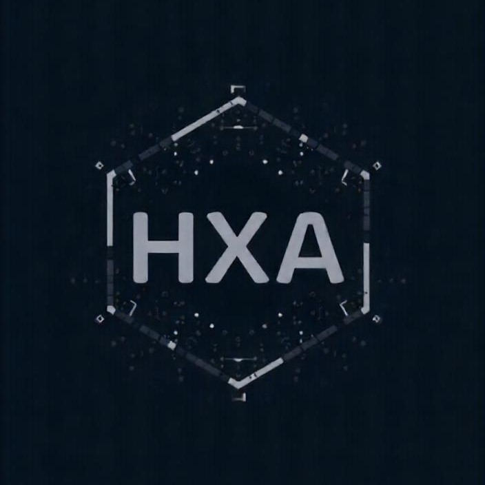

# hexarch
成员：
+ [PB23111723黄明昊](https://github.com/VideoBus66)（Group Leader）
+ [PB23111726李易](https://github.com/Leeyiiii)
+ [PB23111697刘思宇](https://github.com/MrKyomoto)
+ [PB23000055于皓翔](https://github.com/Parfait5)
+ [PB23111596王超然](https://github.com/cmdyc)
+ [PB23061139马文宇](https://github.com/LUNACY72)

## 项目进度
| 日期      | 事件     | 结果                                                    | 备注           |
| --------- | -------- | ------------------------------------------------------- | -------------- |
|2025.3.3-2025.3.12|各自调研，提出选题|于皓翔：[OS preresearch RAY](https://github.com/OSH-2025/hexarch/blob/master/docs/preResearch/%E4%BA%8E%E7%9A%93%E7%BF%94_OS_preresearch_RAY.pdf)； 刘思宇：[FreeRTOS与FATFS的重构及结合](https://github.com/OSH-2025/hexarch/blob/master/docs/preResearch/%E5%88%98%E6%80%9D%E5%AE%87_freeRTOS%20%26%20FatFs%E7%BB%93%E5%90%88%E4%BB%A5%E5%8F%8A%E9%87%8D%E6%9E%84%E7%9A%84%E5%8F%AF%E8%A1%8C%E6%80%A7%E6%8E%A2%E8%AE%A8.pdf)； 李易：[ROS(机器人操作系统)调研](https://github.com/OSH-2025/hexarch/blob/master/docs/preResearch/%E6%9D%8E%E6%98%93-ROS.md)； 王超然：[虚拟化技术](https://github.com/OSH-2025/hexarch/blob/master/docs/preResearch/%E7%8E%8B%E8%B6%85%E7%84%B6-%E8%99%9A%E6%8B%9F%E5%8C%96%E6%8A%80%E6%9C%AF.md)； 黄明昊：[Nginx负载均衡算法优化](https://github.com/OSH-2025/hexarch/blob/master/docs/preResearch/%E9%BB%84%E6%98%8E%E6%98%8A-Nginx%E5%8F%8D%E5%90%91%E4%BB%A3%E7%90%86%E7%9A%84%E8%B4%9F%E8%BD%BD%E5%9D%87%E8%A1%A1%E7%AE%97%E6%B3%95%E4%BC%98%E5%8C%96%E4%B8%8E%E5%AE%9E%E7%8E%B0.pdf)； 马文宇：[AIOS](https://github.com/OSH-2025/hexarch/blob/master/docs/preResearch/%E9%A9%AC%E6%96%87%E5%AE%87-AIOS.pdf)；|老师否定了改进Nginx相关的选题|
|2025.3.15|第一次讨论（线下）|对选题进行了初步的探讨，确定了几个基本方向，准备与老师讨论| [0315 1st discussion](https://github.com/OSH-2025/hexarch/blob/master/docs/discussion/0315_1st_discussion.md)|
|2025.3.17|与老师讨论|将“FreeRTOS与FATFS的重构及结合”与“基于区块链的分布式文件系统”作为初步的选题，准备调研之后从中确定选题||
|2025.3.18-2025.3.23|各自选择两者之一调研|于皓翔：[Blockchain_Research](https://github.com/OSH-2025/hexarch/blob/master/docs/preResearch/%E4%BA%8E%E7%9A%93%E7%BF%94_Blockchain_Research.pdf)； 刘思宇：[FreeRTOS与FATFS的重构及结合](https://github.com/OSH-2025/hexarch/blob/master/docs/preResearch/%E5%88%98%E6%80%9D%E5%AE%87_freeRTOS%20%26%20FatFs%E7%BB%93%E5%90%88%E4%BB%A5%E5%8F%8A%E9%87%8D%E6%9E%84%E7%9A%84%E5%8F%AF%E8%A1%8C%E6%80%A7%E6%8E%A2%E8%AE%A8.pdf); 李易：[基于区块链和IPFS的操作系统可能选题调研](https://github.com/OSH-2025/hexarch/blob/master/docs/preResearch/%E6%9D%8E%E6%98%93-%E5%9F%BA%E4%BA%8E%E5%8C%BA%E5%9D%97%E9%93%BE%E5%92%8CIPFS%E7%9A%84%E6%93%8D%E4%BD%9C%E7%B3%BB%E7%BB%9F%E5%8F%AF%E8%83%BD%E9%80%89%E9%A2%98%E8%B0%83%E7%A0%94.md); 王超然：[区块链技术](https://github.com/OSH-2025/hexarch/blob/master/docs/preResearch/%E7%8E%8B%E8%B6%85%E7%84%B6-%E5%8C%BA%E5%9D%97%E9%93%BE%E6%8A%80%E6%9C%AF.md); 黄明昊：[基于区块链的模型驱动文件系统](https://github.com/OSH-2025/hexarch/blob/master/docs/preResearch/%E9%BB%84%E6%98%8E%E6%98%8A-%E5%9F%BA%E4%BA%8E%E5%8C%BA%E5%9D%97%E9%93%BE%E7%9A%84%E6%A8%A1%E5%9E%8B%E9%A9%B1%E5%8A%A8%E6%96%87%E4%BB%B6%E7%B3%BB%E7%BB%9F.pdf)||
|2025.3.23|第二次讨论（线下）|在两个不同的选题中，经过“激烈”的讨论，最终选定为：FreeRTOS与FatFs的结合及部分内核的Rust重构与添加| [0323 2nd discussion](https://github.com/OSH-2025/hexarch/blob/master/docs/discussion/0323_2nd_discussion.md)|
|2025.3.24|第三次讨论（线下）|我们在线下具体讨论了调研报告的内容和分工||
|2025.3.29|第四次讨论（线下）|我们在研讨室根据这一周各自的调研内容，撰写了最终的调查报告，具体分工为：于皓翔 - C语言的局限性和Rust的优越性，C语言与Rust的混合编译；刘思宇&&李易 - FreeRTOS文档&&源码阅读；黄明昊&&马文宇 - FatFs文档&&源码阅读；王超然 - FreeRTOS 系统可拓展模块及其应用场景||
