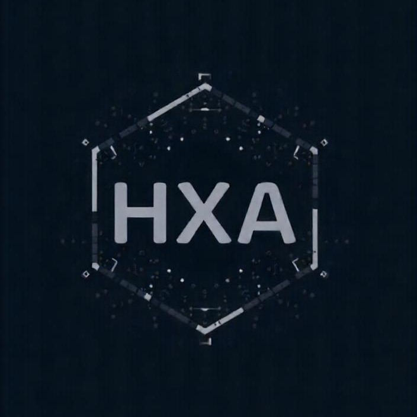

# hexarch
成员：
+ [PB23111723黄明昊](https://github.com/VideoBus66)（Group Leader）
+ [PB23111726李易](https://github.com/Leeyiiii)
+ [PB23111697刘思宇](https://github.com/MrKyomoto)
+ [PB23000055于皓翔](https://github.com/Parfait5)
+ [PB23111596王超然](https://github.com/cmdyc)
+ [PB23061139马文宇](https://github.com/LUNACY72)

## 项目进度
| 日期      | 事件     | 结果                                                    | 备注           |
| --------- | -------- | ------------------------------------------------------- | -------------- |
|2025.3.3-2025.3.12|各自调研，提出选题|于皓翔：OS preresearch RAY； 刘思宇：FreeRTOS与FATFS的重构及结合； 李易：ROS(机器人操作系统)调研； 王超然：虚拟化技术； 黄明昊：Nginx负载均衡算法优化； 马文宇：AIOS；|老师否定了改进Nginx相关的选题|
|2025.3.15|第一次讨论（线下）|对选题进行了初步的探讨，确定了几个基本方向，准备与老师讨论| [0315 1st discussion](https://github.com/OSH-2025/hexarch/blob/master/docs/discussion/0315_1st_discussion.md)|
|2025.3.17|与老师讨论|将“FreeRTOS与FATFS的重构及结合”与“基于区块链的分布式文件系统”作为初步的选题，准备调研之后从中确定选题||
|2025.3.18-2025.3.23|各自选择两者之一调研|||
|2025.3.23|第二次讨论（线下）|在两个不同的选题中，经过“激烈”的讨论，最终选定为：FreeRTOS与FatFs的结合及部分内核的Rust重构与添加| [0323 2nd discussion](https://github.com/OSH-2025/hexarch/blob/master/docs/discussion/0323_2nd_discussion.md)|