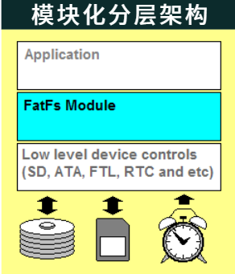
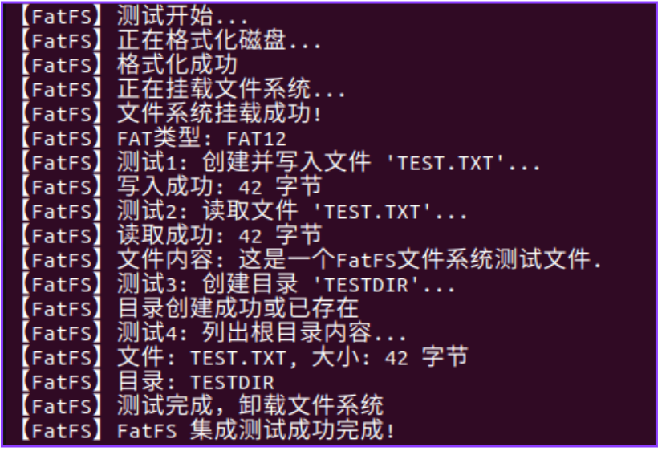
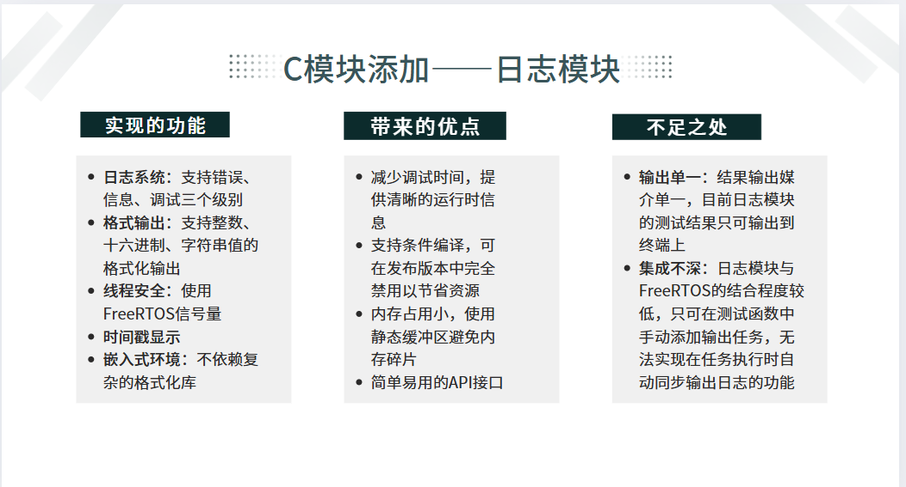
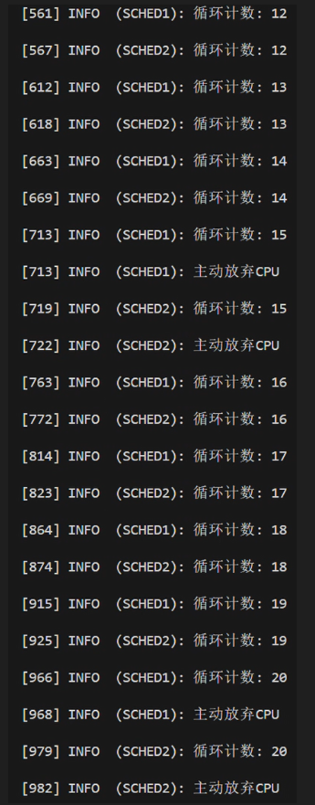
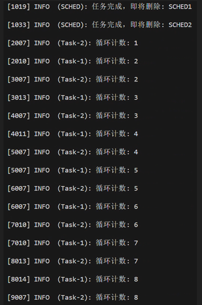
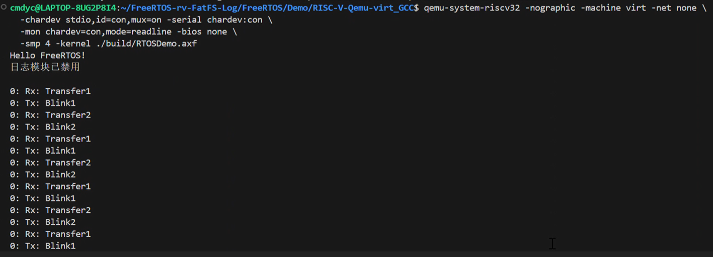
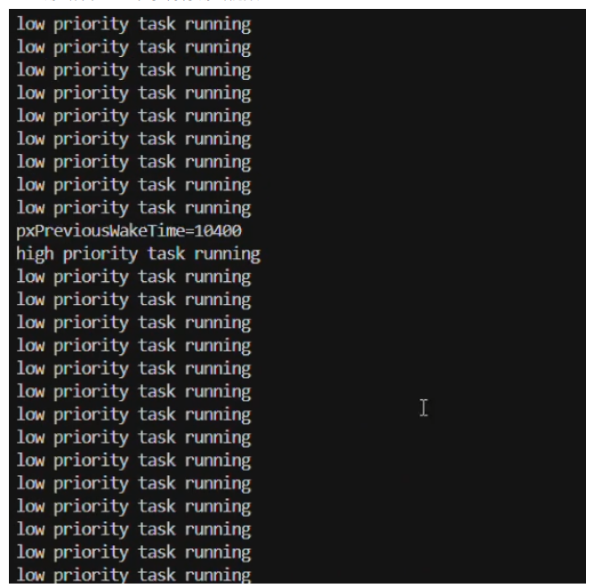
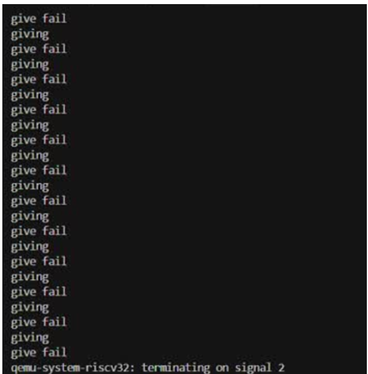
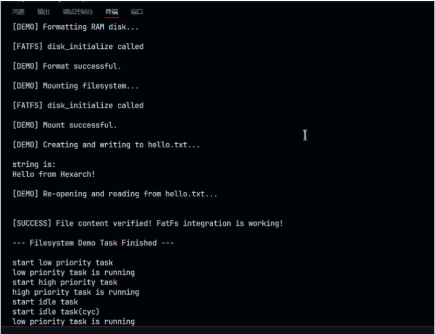

# Hexarch小组结题报告

成员：刘思宇 李易 于皓翔 王超然 马文宇 黄明昊

## 0 目录

- [Hexarch小组结题报告](#hexarch小组结题报告)
  - [0 目录](#0-目录)
  - [1 项目简介](#1-项目简介)
  - [2 项目背景](#2-项目背景)
    - [2.1 FreeRTOS](#21-freertos)
    - [2.2 Rust](#22-rust)
    - [2.3 Why](#23-why)
      - [2.3.1 Rust重构](#231-rust重构)
      - [2.3.2 添加文件模块](#232-添加文件模块)
      - [2.3.3 添加日志模块](#233-添加日志模块)
  - [3 项目过程](#3-项目过程)
    - [3.1 C-添加文件模块](#31-c-添加文件模块)
      - [3.1.1 Why FatFS？](#311-why-fatfs)
      - [3.1.2 实现思路-1](#312-实现思路-1)
      - [3.1.3 实现的功能-1](#313-实现的功能-1)
      - [3.1.4 文件模块测试](#314-文件模块测试)
      - [3.1.5 Why not Rust-FatFS？](#315-why-not-rust-fatfs)
    - [3.2 C-添加日志模块](#32-c-添加日志模块)
      - [3.2.1 实现思路-2](#321-实现思路-2)
      - [3.2.2 实现的功能-2](#322-实现的功能-2)
      - [3.2.3 带来的好处](#323-带来的好处)
      - [3.2.4 日志模块的不足](#324-日志模块的不足)
      - [3.2.5 日志模块测试](#325-日志模块测试)
    - [3.3 C-模块化解耦](#33-c-模块化解耦)
      - [3.3.1 意义](#331-意义)
      - [3.3.2 方法论](#332-方法论)
      - [3.3.3 具体拆分实例与细节](#333-具体拆分实例与细节)
      - [3.3.4 C模块化与Rust重构的对应关系](#334-c模块化与rust重构的对应关系)
    - [3.4 C-to-Rust](#34-c-to-rust)
      - [3.4.1 数据结构对应关系](#341-数据结构对应关系)
      - [3.4.2 no\_std环境](#342-no_std环境)
      - [3.4.3 宏](#343-宏)
      - [3.4.4 unsafe处理](#344-unsafe处理)
      - [3.4.5 其它困难与解决](#345-其它困难与解决)
      - [3.4.6 重构后的FreeRTOS模块](#346-重构后的freertos模块)
      - [3.4.7 Qemu测试](#347-qemu测试)
      - [3.4.7 几个改写过程中的关键步骤](#347-几个改写过程中的关键步骤)
    - [3.5 Rust-添加模块](#35-rust-添加模块)
    - [3.6上板](#36上板)
  - [4 项目总结](#4-项目总结)
    - [4.1 成果回顾](#41-成果回顾)
    - [4.2 往年项目对比](#42-往年项目对比)
    - [4.3 不足与展望](#43-不足与展望)

## 1 项目简介

首先是我们**做了什么**：

我们使用RUST对FreeRTOS进行了重构，增加了文件模块与日志模块这两个可选模块，最后还使用Qemu进行了测试。

下面是我们的简要**技术路线**：

1.对于C语言版本的FreeRTOS: 添加FatFS文件模块, 添加日志模块;

2.对于C语言版本的FreeRTOS: 进行模块化解耦, 为Rust重构铺垫;

3.对于C语言版本的FreeRTOS: 基于'2'进行Rust改写, 得到了Rust版本的FreeRTOS, 并进行重构;

4.对于Rust版本的FreeRTOS: 添加FatFS文件模块, 添加日志模块。

>虽然存在一些不足，但是我们大体完成了中期时设定的目标，相关内容被放在了 项目总结 部分

## 2 项目背景

### 2.1 FreeRTOS

首先简要介绍一下项目主体：FreeRTOS

FreeRTOS是一个广泛使用的实时操作系统(Real-time operating system, RTOS)，专为嵌入式系统设计，由Richard Barry于2003年首次发布并持续维护至今。FreeRTOS以其简洁、高效、可裁剪的特点，在全球范围内获得了广泛的认可和应用，其优点包括但不限于以下几点：

- **流行性**：FreeRTOS是最主流的嵌入式操作系统之一，在全球范围内被广泛采用，拥有庞大的社区支持和活跃的生态系统。

- **功能丰富**：FreeRTOS提供了丰富的功能，如任务管理、内存管理、同步机制等，同时还支持文件系统，满足了嵌入式系统的各种需求。

- **性能优异**：FreeRTOS实时性能出色，能够满足嵌入式系统的实时性需求。

- **源代码质量**：FreeRTOS代码精简、可读性强，易于移植到各种嵌入式平台，对开发者友好。

- **版权"友好"**：FreeRTOS的许可证商业友好，允许商业应用和修改，没有版权的后顾之忧。

### 2.2 Rust

接着简要介绍一下项目主要使用的语言：Rust

Rust 是一门系统级别的编程语言，它很好地解决了C/C++等语言在系统级编程中常见的安全性和并发性等问题。

传统的系统级编程语言（如C/C++等）在处理内存安全性和并发性时面对着诸多挑战，如空指针、越界访问和数据竞争等。而Rust的设计目标之一就是通过强大的类型系统和所有权机制解决上述的这些问题，提高代码的安全性和可靠性。

Rust的优点包括但不限于以下几点：

- **内存安全性**：Rust通过所有权系统、借用检查器和生命周期管理等机制，确保在编译时就避免了诸多内存安全问题，如空指针、越界访问、数据竞争等。

- **并发性**：Rust内置了轻量级的线程模型和消息传递机制，使并发编程更加容易和安全。

- **性能**：Rust的性能与C/C++相当，甚至在某些情况下更好。它通过零成本抽象和内联优化等技术实现了高性能。

- **模式匹配**：Rust拥有强大的模式匹配功能，可用于处理复杂的数据结构和状态转换，使代码更加清晰、易于维护。

- **生态系统**：Rust拥有活跃的社区和丰富的库，可以轻松地与其他语言进行集成，还有各种功能强大的工具和框架，如cargo构建系统等。

**Rust语言特性对我们项目开发的启发和要求**：

- **所有权机制**
  
  Rust确保了内存安全，防止了缓冲区溢出、越界访问等常见的内存错误，这就要求我们在编写代码时必须仔细思考内存的分配和使用，防止代码中出现未预料到的更改，从而影响代码的正确性和安全性。

- **生命周期管理与借用规则**
  
  Rust提供了丰富的生命周期管理功能和借用规则，这就要求我们在编写代码时必须考虑数据的有效期和访问权限，提升代码的安全性，增强软件的可维护性和可读性。

- **类型安全与借用检测器**
  
  Rust的借用检查器保证了代码的类型安全，能够在编译时期就发现潜在的类型错误，这就要求我们在编写代码时必须严格遵守类型规则，确保数据类型的正确匹配，以避免程序在运行时期的类型错误。

### 2.3 Why

下面是我们选择这个项目的目的：

#### 2.3.1 Rust重构

- **安全**

  Rust通过所有权系统、借用检查器和生命周期管理等机制，确保在编译时避免内存安全问题，如空指针、野指针、数据竞争等，提高了内存安全性。相比C语言，Rust在编译阶段就能发现绝大多数潜在的内存错误，极大地降低了因内存泄漏、悬垂指针等问题导致的系统崩溃风险。这对于嵌入式系统的稳定运行至关重要。

- **解耦**

  在重构过程中，我们将FreeRTOS的各个功能模块（如任务管理、内存管理、文件系统、日志系统等）进行模块化拆分，减少模块之间的耦合度。Rust的模块系统和强类型机制使得各模块之间的接口更加清晰，便于后续的维护和功能扩展。同时，模块化设计也有助于提升代码的可读性和可测试性。

#### 2.3.2 添加文件模块

FreeRTOS 作为轻量级实时操作系统，默认未集成文件系统功能，在嵌入式开发中可能引发以下不便：

- **数据存储复杂性提升**：缺乏标准文件系统接口，需开发者自行实现数据组织与存储逻辑（如按块读写、文件格式定义），增加代码量与调试成本。

- **外部存储设备支持薄弱**：无法直接适配 SD 卡、U 盘等常见存储介质，需额外开发底层驱动与管理逻辑，降低开发效率。

- **功能拓展成本高**：若需实现日志记录、数据持久化等功能，需从零构建文件操作框架，难以复用成熟方案，且易引入内存管理漏洞。

- **跨平台兼容性受限**：不同存储设备的接口差异需重复适配，缺乏统一文件系统抽象层，导致代码可移植性降低。

因此，我们为FreeRTOS集成FatFS文件系统，以期解决上述问题。

#### 2.3.3 添加日志模块

FreeRTOS 默认未集成日志模块，在嵌入式开发中可能引发以下问题：

- 调试效率低下与问题定位困难：一方面，缺乏日志记录机制，无法实时获取任务状态、资源占用、异常事件等关键信息，导致调试时需依赖硬件调试器单步跟踪，效率极低；另一方面，错误定位成本高，系统运行中出现异常时，无法通过日志回溯操作序列或状态变化，难以快速定位崩溃点或逻辑错误。

- 系统状态监控能力薄弱：任务调度与资源竞争无迹可寻：无法记录任务切换频率、优先级反转、队列阻塞等调度事件，难以优化系统实时性或发现潜在的调度缺陷。

- 维护与迭代成本增加：嵌入式设备部署后若出现问题，因无日志记录运行时环境，难以在开发环境复现故障场景。

- 多任务协同调试难度大：多任务环境下的竞态条件、死锁等问题，无法通过日志分析任务执行顺序或资源抢占过程，需借助复杂的调试工具辅助。

因此，我们为FreeRTOS集成日志模块，以期解决上述问题。

## 3 项目过程

### 3.1 C-添加文件模块

#### 3.1.1 Why FatFS？

我们选择了FatFS文件系统作为我们的文件模块部分，主要原因如下：

- **广泛兼容性**：FatFS 支持 FAT12/16/32 文件系统，能够兼容绝大多数 SD 卡、U 盘等主流存储介质，适用于嵌入式系统常见的外部存储需求。

- **开源且易于集成**：FatFS 采用宽松的开源协议，源码结构清晰，移植性强，能够方便地集成到 FreeRTOS 这类嵌入式操作系统中，且有丰富的移植文档和社区支持。

- **资源占用低**：FatFS 针对嵌入式场景进行了优化，代码体积小、内存占用低，非常适合资源受限的微控制器环境。

- **功能完善**：FatFS 提供了完整的文件操作接口（如文件读写、目录管理、文件属性设置等），支持长文件名、时间戳、文件权限等高级功能，满足嵌入式应用对文件系统的多样化需求。

- **稳定可靠**：FatFS 已在大量实际项目中得到验证，具有良好的稳定性和可靠性，能够保障数据的安全存储和高效访问。

- **易于维护和扩展**：FatFS 的模块化设计便于后续功能扩展和维护，能够根据项目需求灵活裁剪功能，提升系统的可维护性。

综上，FatFS 是嵌入式系统中应用最广泛、最成熟的文件系统解决方案之一，非常适合在 FreeRTOS 项目中集成使用，能够显著提升系统的数据管理能力和开发效率。

#### 3.1.2 实现思路-1

FatFS的整体实现采用了模块化分层架构，核心文件包括7个：ff.c、ff.h、ffconf.h（配置头文件）、diskio.c、diskio.h、ffsystem.c（操作系统依赖函数实现）、ffunicode.c（Unicode编码支持模块）。整个架构分为三层：

1. **应用层**  
   该层为用户提供标准化的API接口，使用户能够通过简单的函数调用来操作文件系统，无需关心底层实现细节。常用的文件操作函数包括：`f_mount`（挂载文件系统）、`f_open`（打开文件）、`f_read`（读取文件）、`f_write`（写入文件）、`f_close`（关闭文件）等。这些接口极大地简化了嵌入式开发中对文件系统的操作。

2. **文件系统逻辑层**  
   该层的核心文件为`ff.h`和`ff.c`，实现了FAT文件系统的核心逻辑，包括文件的分配、目录管理、FAT表维护等，是FatFS的核心部分。该层负责将用户的文件操作请求转化为对底层存储设备的具体读写操作，并保证文件系统的一致性和数据安全。

3. **底层设备驱动层**  
   该层的核心文件为`diskio.h`和`diskio.c`，主要负责与底层存储设备的交互。在本项目中，`diskio.c`实现了一个RAM磁盘，通过静态分配的内存数组`ramdisk`来模拟存储设备。这样做的好处有：
   - 不受物理设备影响，开发和调试更加灵活；
   - 内存直接访问，读写速度高，便于快速测试；
   - 资源消耗低，适合嵌入式开发初期的功能验证；
   - 后续如需切换到MMC或USB等物理存储设备，只需在`diskio.c`中做少量修改即可，无需更改上层逻辑。



**为什么选择RAM磁盘？**

在FatFS的底层设备驱动实现（diskio.c）中，官方提供了三种存储介质的支持选项：RAM、MMC（SD卡）、USB。我们本项目选择了RAM磁盘作为底层存储，主要原因如下：

1. **不受物理设备影响**：RAM磁盘完全基于系统内存实现，无需依赖实际的SD卡或U盘等物理硬件，极大地方便了开发和调试。

2. **读写速度高**：内存的访问速度远高于物理存储设备，有助于快速验证文件系统的各项功能，提高开发效率。

3. **调试便利**：无需插拔外部设备，调试过程更为简单直接，便于定位和修复问题。

4. **资源消耗低**：RAM磁盘实现简单，占用资源少，适合嵌入式开发初期的功能验证和单元测试。

此外，FatFS的分层设计使得后续如需切换到MMC或USB等物理存储设备时，只需在diskio.c中针对相关接口做少量修改，无需更改上层文件系统逻辑，极大提升了系统的可扩展性和可维护性。

**移植过程简述：**

- 首先根据项目需求，修改`ffconf.h`中的相关宏定义，配置文件系统参数；
- 然后在`diskio.c`中实现关键函数（如`disk_initialize`、`disk_status`、`disk_read`、`disk_write`、`disk_ioctl`），使其适配RAM磁盘；
- 最后在`main.c`中编写测试函数，对文件系统的各项功能进行验证。

通过上述分层架构和模块化设计，FatFS不仅实现了良好的可移植性和可扩展性，也为后续功能拓展和硬件适配提供了便利。

#### 3.1.3 实现的功能-1

我们实现了图中所示的功能：初始化（磁盘格式化、文件系统挂载与卸载），文件的基本操作（比如创建、写入、读取、关闭等），目录的基本操作（比如创建、遍历等）。

可以较好地满足用户对一个文件系统的基础需求。


#### 3.1.4 文件模块测试

**文件模块运行示例：**

我们编写了测试任务，并在Qemu上测试文件系统的各项功能：

从输出信息中，我们可以看到：



成功实现了磁盘的格式化、文件系统的挂载，同时输出了 FAT 的类型，然后依次是几个简单的小测试，测试文件的创建、写入、读取，目录的读取、列出根目录内容，最后卸载文件系统，完成 FatFS 的测试。

结果表明，我们成功为FreeRTOS添加了文件模块。

#### 3.1.5 Why not Rust-FatFS？

实际上，早在中期之前，我们便发现了Rust版本的FatFS，但是我们**为什么选择将C语言版本的FatFS加入系统，而不是用rust版本的？**  

对于这个问题，我们在中期的时候就打算：如果有多余的精力，就尝试自己写rust版本的FatFS，但是改写freeRTOS几乎消耗了我们的所有精力，我们确实没有时间再对FatFS进行改写。不过我们找到了rust版本的fatfs，但是这个库不知为何无法添加，因此我们最终只能选用C语言版本的FatFS。

### 3.2 C-添加日志模块

本模块是在FreeRTOS系统基础上开发的C语言日志系统，旨在为嵌入式开发提供高效、灵活的日志记录能力。

#### 3.2.1 实现思路-2

本日志模块的设计和实现充分考虑了嵌入式系统的资源约束和多任务特性，采用模块化、可裁剪、线程安全的架构，具体思路如下：

**核心文件结构：**

- `log.c`：日志模块的主要实现文件，包含日志输出、级别管理、线程安全等核心逻辑。
- `log.h`：日志模块的头文件，定义了日志级别、配置结构体及所有对外API接口。
- `main_blinky.c`：集成日志模块的测试主程序，包含典型的生产者-消费者、调度器等测试任务。

**log.h主要数据结构与接口：**

```c
typedef enum {
    LOG_LEVEL_NONE = 0,   // 不输出日志
    LOG_LEVEL_ERROR,      // 错误信息
    LOG_LEVEL_INFO,       // 一般信息
    LOG_LEVEL_DEBUG,      // 调试信息
} LogLevel_t;

typedef struct {
    LogLevel_t level;         // 当前日志级别
    bool show_timestamp;      // 是否显示时间戳
} LogConfig_t;

// 日志系统初始化与配置
bool log_init(LogConfig_t *config);
void log_set_level(LogLevel_t level);
LogLevel_t log_get_level(void);

// 基本日志输出接口
void log_error(const char *tag, const char *message);
void log_info(const char *tag, const char *message);
void log_debug(const char *tag, const char *message);
// 还可扩展如log_info_int、log_info_str等带参数接口
```

- **日志初始化函数log_init**：这个函数是整个日志系统的入口点，负责系统的初始化工作。它接受一个`LogConfig_t`类型的配置参数，允许用户在系统启动时就定制日志的行为，比如设置默认的日志级别和是否显示时间戳。
- **日志级别管理函数组**：`log_set_level`函数用于动态设置当前的日志输出级别，而`log_get_level`函数则用于获取当前的日志级别设置。
- **核心输出函数log_write_internal**：虽然这个函数在头文件中没有直接暴露，但它是整个日志系统的核心。所有的日志输出最终都会通过这个函数来处理，它负责格式化、线程安全控制和最终的输出操作。
- **格式转换函数int_to_str**：这个函数专门负责将整数转换为字符串。在嵌入式环境中，我们避免使用标准库的`sprintf`函数，而是自己实现这个轻量级的转换函数，既保证了功能完整性，又控制了资源消耗。
- **函数的重新包装机制**：从代码中可以看到，所有其他的日志函数，比如`log_error`、`log_info`、`log_debug`等，实际上都是对`log_write_level`函数的重新包装，便于使用者调用。

**条件编译：**

**条件编译机制与优化效果：**

日志模块在设计时充分考虑了嵌入式系统资源有限的特点，因此采用了灵活的条件编译机制，实现了日志功能的可选性。其核心思想是在编译阶段通过宏定义，决定是否将日志相关代码编译进最终的固件，从而兼顾开发调试和产品发布的不同需求。

**实现方式：**

1. **配置宏控制**  

   在`FreeRTOSConfig.h`中添加`configUSE_LOG_MODULE`宏，用于控制日志模块的启用与否。例如：

   ```c
   #ifndef configUSE_LOG_MODULE
       #define configUSE_LOG_MODULE    1  // 默认启用日志
   #endif
   ```

2. **编译参数切换**  

   通过Makefile参数`ENABLE_LOG`，用户可在编译时灵活选择是否启用日志模块：

   ```Makefile
   make ENABLE_LOG=1   // 启用日志
   make ENABLE_LOG=0   // 禁用日志
   ```

   Makefile会自动将对应的宏传递给编译器，实现一键切换。

3. **代码层条件编译**  

   在`log.h`和`log.c`中，利用条件编译指令`#if (configUSE_LOG_MODULE == 1)`，分别提供完整的日志实现或空操作宏。例如：

   - 启用时，提供所有日志API的真实实现，支持多级别、线程安全、时间戳等功能。
   - 禁用时，所有日志API均被定义为`do {} while(0)`的空宏，编译器会自动优化掉这些代码，不产生任何机器码，也不占用ROM/RAM空间。

**优化效果：**

- **启用日志模块时：**
  - 编译器会包含完整的日志实现代码，支持多级别、线程安全、时间戳等功能。
  - 适合开发和调试阶段，便于问题定位和系统分析。
  - 会增加一定的代码体积和运行时开销。

- **禁用日志模块时：**
  - 所有日志相关调用均被替换为空操作，编译器会完全移除这些代码。
  - 不占用任何ROM/RAM空间，日志模块运行时零开销。
  - 适合产品发布和资源极度受限的场景。

**日志模块核心机制总结：**

1. **日志级别过滤**：所有日志输出前先判断当前日志级别，低于设定级别的日志不会输出，保证输出内容的可控性。

2. **线程安全保障**：日志输出前自动获取FreeRTOS信号量（互斥量），输出后释放，确保多任务环境下日志内容不会交叉、错乱。

3. **静态缓冲区与格式化**：采用静态分配的缓冲区拼接日志内容，避免动态内存分配带来的碎片和不确定性。支持时间戳、日志级别、标签、消息体等多字段拼接。

4. **轻量级格式转换**：自定义实现整数转字符串（int_to_str）等基础格式化函数，避免依赖`sprintf`等标准库，兼顾功能和资源消耗。

5. **API包装机制**：所有对外日志接口（如log_error、log_info等）最终调用内部核心输出函数（如log_write_internal），统一格式和输出方式，便于维护和扩展。

6. **条件编译与可裁剪性**：通过configUSE_LOG_MODULE宏和Makefile参数，支持一键启用/禁用日志模块，禁用时所有日志API自动替换为空操作，零运行时开销。

通过上述设计，日志模块不仅实现了高效、可靠的日志输出，还兼顾了嵌入式系统的资源约束和可维护性，为后续功能扩展和系统调试提供了坚实基础。



#### 3.2.2 实现的功能-2

1. **多级别日志支持**  
   日志模块支持错误（Error）、信息（Info）、调试（Debug）三个标准日志级别，开发者可根据实际需求灵活选择输出级别。

2. **格式化输出**  
   模块不仅支持基本的字符串输出，还提供了整数、十六进制数值以及字符串拼接的格式化输出功能，满足嵌入式调试的多样化需求。

3. **线程安全**  
   线程安全保障。考虑到FreeRTOS的多任务特性，我们使用了FreeRTOS的信号量机制来确保多线程环境下日志输出的安全性和一致性。

4. **时间戳功能**  
   每条日志自动添加时间戳，便于追踪和分析系统运行过程中的事件顺序。

5. **轻量级实现**  
   不依赖复杂的格式化库，采用静态缓冲区，避免内存碎片，适合资源受限的嵌入式环境。

#### 3.2.3 带来的好处

- **提升调试效率**：运行时信息输出帮助开发者快速定位问题，显著减少调试时间。
- **支持条件编译**：通过配置开关，可在发布版本中完全禁用日志功能，节省系统资源。
- **内存占用优化**：使用静态缓冲区，避免动态分配带来的内存碎片问题。
- **API简单易用**：只需调用少量接口即可实现完整日志功能，降低开发门槛。

#### 3.2.4 日志模块的不足

- **输出媒介单一**：目前日志仅支持输出到终端，缺乏如文件、网络等多样化输出方式，限制了应用场景。
- **集成深度有限**：日志模块与FreeRTOS的结合还不够紧密，日志输出需在测试任务中手动调用，尚未实现自动化、全局的日志采集与同步。

#### 3.2.5 日志模块测试

**1. 测试任务设计与目的：**

日志模块的测试主要围绕多任务环境下的日志输出正确性、线程安全性和功能完整性展开，设计了如下典型任务：

- **调度器测试任务（scheduler_test_task）**：
  - 目的：验证日志模块对FreeRTOS任务调度的影响，确保日志输出不会阻塞或干扰系统调度。
  - 特点：不依赖硬件GPIO，避免硬件因素干扰测试结果，专注于任务调度与日志输出的协同。

- **生产者-消费者测试任务（log_send_task/log_recv_task）**：
  - 目的：模拟多任务环境下日志的高频产生与消费，测试日志模块的线程安全性和高并发下的稳定性。
  - 特点：生产者任务持续产生日志，消费者任务持续消费并记录日志。

- **对照组任务**：
  - 目的：与不使用日志的生产者/消费者任务（prvQueueSendTask/prvQueueReceiveTask）对比，分析日志模块对系统性能和行为的影响。

**2. 测试现象与结果说明：**

`scheduler_test_task`



从结果上看，每隔五个计数周期，FreeRTOS进行一次任务切换，总共20周期，且日志输出正确，与预期相符；

`log_send_task & log_recv_task`



从结果上看，Task-1和Task-2成对交替出现，且日志输出正确，与预期相符;

`prvQueueSendTask & prvQueueReceiveTask`



从结果上看，Rx与Tx成对交替出现，与预期相符。

### 3.3 C-模块化解耦

在本项目中，我们对FreeRTOS的C代码进行了系统性的模块化解耦。这样做不仅提升了代码的可维护性、可读性和复用性，也为后续的Rust重构打下了坚实基础。

#### 3.3.1 意义

- **提升可维护性与可读性**：每个模块职责单一，便于理解和维护。
- **增强代码复用性**：通用功能可在不同场景下复用，减少重复开发。
- **促进团队协作**：不同成员可并行开发各自负责的模块，提高开发效率。
- **为Rust重构铺路**：模块边界清晰，便于逐步迁移和重构为Rust代码。

#### 3.3.2 方法论

1. **功能与职责分析**
   - 梳理所有导出接口（extern函数）和内部实现（static函数）。
   - 按照功能归类，每类功能对应一个独立子模块。

2. **模块划分与文件结构设计**
   - 为每个功能模块创建独立的实现文件和头文件。
   - 公共接口放在公有头文件（如 queue.h），内部辅助函数和宏放在私有头文件（如 queue_private.h）。

3. **作用域与封装**
   - 使用`static`修饰仅在本模块内部使用的函数和变量，隐藏实现细节。
   - 通过`extern`在头文件中暴露模块的公共接口，减少模块间的耦合。
   - 公共接口只接受必要参数，不直接操作其他模块的内部数据结构。

4. **单元测试与验证**
   - 拆分后对各模块进行单元测试，确保功能正确性和独立性。

#### 3.3.3 具体拆分实例与细节

以FreeRTOS内核的主要文件为例：

- **queue.c**（原有31个函数，1681行代码）被拆分为：
  - queue_base.c：队列基本操作
  - queue_mutex.c：互斥量与信号量相关
  - queue_isr.c：中断相关队列操作
  - queue_registry.c：队列注册表相关
  - queue_private.c：私有静态函数实现

- **tasks.c**（原有41个函数，2506行代码）被拆分为：
  - task_create.c：任务创建与删除
  - task_schedule.c：任务调度与切换
  - task_delay.c：任务延时与挂起
  - task_priority.c：任务优先级与状态管理
  - task_hook.c：任务钩子与统计
  - task_private.c：私有静态函数实现

- **timers.c**（原有15个函数，687行代码）被拆分为：
  - timers_core.c：定时器的创建、启动、停止
  - timers_queue.c：定时器命令队列相关
  - timers_task.c：定时器服务任务实现
  - timers_private.c：私有静态函数实现

对于大量的宏定义和宏函数，我们也做了专门处理：

- 与模块相关的宏定义被分别放入公有头文件和私有头文件。
- 公有宏（API 宏、配置开关宏）放在 module.h（如 queue.h）里。
- 内部辅助宏放在 module_private.h（如 queue_private.h）里。
- 在Rust重构时，这些宏被转化为Rust的宏或常量，保证功能一致性。

宏函数的优势在于：

1. 消除函数调用开销
2. 保持对局部变量和上下文的访问
3. 具有条件编译的灵活性

因此，许多功能都采用了宏函数实现，处理方式与普通宏定义一致。

#### 3.3.4 C模块化与Rust重构的对应关系

以tasks模块为例，Rust重构时将其拆分为如下子模块：

- mod.rs：模块组织与统一入口，组织和管理子模块，声明子模块（types, creation, scheduler, control），使用 #[macro_use] 导出各模块的宏，重新导出所有子模块的公共接口，提供统一的访问点。
- types.rs：类型与数据结构定义，包含 StackType_t, TCB_t_link, TaskHandle_t 等类型别名，tskTaskControlBlock（任务控制块）、eTaskState（任务状态枚举）、TimeOut（超时结构）、全局变量、常量定义等。
- creation.rs：任务创建与初始化，对应 task_create.c，负责静态/动态任务创建、任务初始化、就绪列表管理、优先级记录等。
- scheduler.rs：调度器核心逻辑，对应 task_schedule.c，负责调度器启动、空闲任务、优先级选择、任务切换、时间管理、延迟管理、任务延迟等。
- control.rs：任务控制与生命周期管理，对应 task_delay.c、task_priority.c、task_hook.c、task_private.c，负责临界区管理、任务挂起/恢复、任务删除、调度器挂起/恢复、优先级管理、互斥锁优先级继承、事件列表管理、超时处理、任务查询等。

每个子模块对应C代码中的一个或多个功能文件，实现了从C到Rust的平滑迁移。

> 我们并没有对内部算法和运行逻辑进行优化，而是专注于FreeRTOS内部各部分的解耦。最终成功对queue.c、tasks.c、timers.c三个文件中的所有函数进行了分类和拆分，并成功运行。

通过模块化解耦，我们不仅优化了C代码结构，也为后续的Rust重构和功能扩展提供了极大的便利。这一过程体现了现代嵌入式系统开发中"高内聚、低耦合"的设计理念。

### 3.4 C-to-Rust

#### 3.4.1 数据结构对应关系

在将FreeRTOS的C代码重构为Rust时，首先需要梳理和对应两种语言中常用的数据结构。大部分基础类型和结构体都可以直接找到一一对应的Rust实现，但也有部分需要特殊处理。下表总结了常见的数据结构映射关系：

| C语言类型/结构         | Rust类型/结构                | 说明/备注                         |
|----------------------|-----------------------------|-----------------------------------|
| `int`                | `i32`                       | Rust中有明确的位宽类型             |
| `unsigned int`       | `u32`                       |                                   |
| `char`               | `u8` / `char`               | `u8`用于字节，`char`为Unicode字符  |
| `float`              | `f32`                       |                                   |
| `double`             | `f64`                       |                                   |
| `void*`              | `*mut c_void` / `*const c_void` | 需用`std::ffi::c_void`            |
| `struct`             | `struct`                    | 语法类似，支持字段可见性           |
| `enum`               | `enum`                      | Rust枚举更强大，支持带数据         |
| `#define`常量        | `const`/`static`            | Rust推荐用`const`或`static`        |
| `#define`宏函数      | `macro_rules!`宏            | Rust用声明式宏实现                 |
| 指针（如`T*`）        | `*mut T` / `*const T` / 智能指针 | 裸指针或智能指针（如`Box`、`Rc`等）|
| 数组`T arr[N]`       | `[T; N]`                    | 固定长度数组                       |
| 动态数组             | `Vec<T>`                    |                                   |
| 链表节点指针         | `Rc<RefCell<Node<T>>>`      | 见下文链表实现                     |
| 全局变量             | `static`/`lazy_static!`     | Rust需保证线程安全                 |

**特殊结构：双向链表的Rust实现：**

C语言中常用的双向链表通常通过结构体嵌套指针实现，例如：

```c
typedf struct Node {
    int value;
    struct Node* next;
    struct Node* prev;
} Node;
```

由于Rust的所有权机制，链表很容易引发不安全的操作。在双向链表中，因为有指向后面的指针和前向指针，可能会形成循环引用（A→B→A），导致内存永远不会被释放。

为此，我们采用了这样的数据结构——`Node<T>`, `Rc<RefCell<Node<T>>>`

> `Node<T>`是链表中的一个节点，存放一个值，比如`value：T`，以及指向前/后节点的指针。
>`Rc<RefCell<Node<T>>>`是核心的节点引用结构，意思是：
>`Rc<T>`：一个"引用计数的智能指针"，允许多个地方（多个节点）共享一个节点的所有权（比如双向链表中，一个节点既被前驱指向，也被后继指向）。
>`RefCell<T>`：一种"运行时检查的可变性容器"。即使Rc是不可变的，你仍然可以在运行时通过`borrow_mut()`修改其内容。
>所以`Rc<RefCell<Node<T>>>`是：一个带共享所有权且支持运行时可变的链表节点。

`RefCell<T>` 允许在上下文中：多次不可变借用;只能有一次可变借用，在运行时会检测借用规则。

`Rc`负责计数:`Weak` 是对 `Rc` 的"弱引用"，不会增加引用计数，从而保证安全性;然后我们也实现了相应的基本操作。

> 克隆（`Rc::clone`）一个指针，内部的计数器就 +1；每当一个 `Rc` 被丢弃（goes out of scope），计数器就 −1；当计数器降到 0 的时候，堆上的值才会被真正 drop，所占内存才被释放给操作系统或分配器
> `Weak` 的安全检查：使用 `weak.upgrade()` 时，会尝试把 `Weak<T>` 临时升级成 `Rc<T>`。如果底层对象已经被所有强引用释放（即所有 `Rc<T>` 的计数都归 0 并已 drop），那么 `upgrade()` 会返回 None，告诉你对象已经不存在了，不会产生悬垂指针。

在Rust中，由于所有权和借用规则，不能直接用裸指针实现自引用结构。我们采用了`Rc<RefCell<Node<T>>>`和`Weak<RefCell<Node<T>>>`的组合来实现双向链表，既保证了多所有权，又避免了循环引用导致的内存泄漏。

在后期我们最终采用了与上述类似的实现Arc + Weak + RwLock来实现数据结构

**核心思路：**

- `Rc<T>`：引用计数智能指针，允许多个所有者（如前驱和后继都持有同一节点的所有权）。
- `RefCell<T>`：运行时可变性，允许在不可变结构中进行可变操作（如修改next/prev）。
- `Weak<T>`：弱引用，不增加引用计数，打破循环引用（用于prev指针）。

**Rust实现示例：**

- **尾插：**

  `self.tail.take()`：把 `self.tail` 取出来（并留下 None），便于对空/非空两种情况做区分。
  - 非空时：
    - 把老尾节点的 `next` 指向新节点。
    - 把新节点的 `prev` 指向老尾节点的弱引用。
    - 把 `self.tail` 更新为新节点。
  - 空链表时：`head` 和 `tail` 同时指向新节点。

- **头插：**
  和尾插相反
  
- **删除指定值：**
  从 `head` 开始遍历，通过 `next` 链不断向后。

  一旦 `value` 匹配，则调用 `unlink` 将该节点"割离"出链表。
  
  `unlink`

  先分别拿到 `prev`（弱引用升级）和 `next`（强引用 `clone`）。
  - 如果有前驱，就把前驱的 `next` 指向自己的后继；否则说明是头节点，要更新 `self.head`。
  - 如果有后继，就把后继的 `prev` 指向自己的前驱（用 `Rc::downgrade`）；否则说明是尾节点，要更新 `self.tail`。

  最后长度 `len` 减 1。

- **修改节点值：**
  遍历查找第一个匹配的节点，找到后直接借用可变引用并赋新值

- **正向打印：**
  从 head 开始，不断跟随 next。

- **反向打印：**
  从 tail 开始，不断把 prev（Weak）升级为 Rc，再继续。

```rust
use std::{cell::RefCell, rc::{Rc, Weak}};

#[derive(Debug)]
struct Node<T> {
    value: T,
    next: RefCell<Option<Rc<RefCell<Node<T>>>>>,
    prev: RefCell<Option<Weak<RefCell<Node<T>>>>>,
}

type Link<T> = Option<Rc<RefCell<Node<T>>>>;

#[derive(Debug)]
struct DoublyLinkedList<T> {
    head: Link<T>,
    tail: Link<T>,
    pub len: usize,
}

impl<T: std::fmt::Debug + PartialEq> DoublyLinkedList<T> {
    fn new() -> Self {
        DoublyLinkedList { head: None, tail: None, len: 0 }
    }

    // 尾插
    fn push_back(&mut self, value: T) {
        let new_node = Rc::new(RefCell::new(Node {
            value,
            next: RefCell::new(None),
            prev: RefCell::new(None),
        }));
        match self.tail.take() {
            Some(old_tail) => {
                *old_tail.borrow().next.borrow_mut() = Some(Rc::clone(&new_node));
                *new_node.borrow().prev.borrow_mut() = Some(Rc::downgrade(&old_tail));
                self.tail = Some(new_node);
            }
            None => {
                self.head = Some(Rc::clone(&new_node));
                self.tail = Some(new_node);
            }
        }
        self.len += 1;
    }

    // 头插
    fn push_front(&mut self, value: T) {
        let new_node = Rc::new(RefCell::new(Node {
            value,
            next: RefCell::new(None),
            prev: RefCell::new(None),
        }));
        match self.head.take() {
            Some(old_head) => {
                *old_head.borrow().prev.borrow_mut() = Some(Rc::downgrade(&new_node));
                *new_node.borrow().next.borrow_mut() = Some(Rc::clone(&old_head));
                self.head = Some(new_node);
            }
            None => {
                self.head = Some(Rc::clone(&new_node));
                self.tail = Some(new_node);
            }
        }
        self.len += 1;
    }

    // 删除第一个值等于 value 的节点
    fn remove(&mut self, value: &T) -> bool {
        let mut current = self.head.clone();
        while let Some(node_rc) = current {
            if node_rc.borrow().value == *value {
                self.unlink(node_rc.clone());
                return true;
            }
            current = node_rc.borrow().next.borrow().as_ref().map(Rc::clone);
        }
        false
    }

    // 内部：断开某个节点的 prev/next 链接
    fn unlink(&mut self, node_rc: Rc<RefCell<Node<T>>>) {
        let prev = node_rc.borrow().prev.borrow().as_ref().and_then(Weak::upgrade);
        let next = node_rc.borrow().next.borrow().clone();

        if let Some(prev_rc) = prev.clone() {
            *prev_rc.borrow().next.borrow_mut() = next.clone();
        } else {
            self.head = next.clone();
        }

        if let Some(next_rc) = &next {
            *next_rc.borrow().prev.borrow_mut() = prev.as_ref().map(Rc::downgrade);
        } else {
            self.tail = prev;
        }

        self.len -= 1;
    }
}

fn main() {
    // 指定类型参数以便编译器推断
    let mut list: DoublyLinkedList<i32> = DoublyLinkedList::new();
    list.push_back(1);
    list.push_back(2);
    list.push_back(3);
    list.print_forward();
    list.print_backward();

    println!("-- 插入头部 0 --");
    list.push_front(0);
    list.print_forward();

    println!("-- 删除值 2 --");
    list.remove(&2);
    list.print_forward();
    list.print_backward();

    println!("-- 修改 3 为 99 --");
    list.update(&3, 99);
    list.print_forward();
}
```

**关键点说明：**

- `next`用`Rc`，`prev`用`Weak`，避免循环引用。
- 通过`RefCell`实现节点内容的可变性。
- 插入、删除、遍历等操作都需注意所有权和借用规则。

**内存安全性：**

- 如果`next`和`prev`都用`Rc`，会导致循环引用，内存无法释放。用`Weak`打破环，保证节点能被正确回收。
- `Weak`的升级（`upgrade()`）只有在节点还存在时才有效，否则返回`None`，不会产生悬垂指针。

**总结：**

FreeRTOS的高性能部分源于其侵入式双向链表等精巧数据结构。C语言通过指针直接操作，效率高但易出错。Rust标准库的`Vec`或`LinkedList`并不完全适合RTOS需求。因此，我们的做法是：

- 重新设计并实现了安全、符合Rust范式的链表结构，采用`Arc<RwLock<T>>`和`Weak<RwLock<T>>`智能指针组合，既保证了多所有权和并发安全，又有效避免了循环引用和内存泄漏。
- 将链表实现封装为独立模块，对外仅暴露安全API（如`vListInsertEnd`），内部隐藏复杂的指针和所有权操作。

这种实现方式既保证了链表的灵活性和效率，又充分利用了Rust的所有权和借用机制，避免了C语言中常见的悬垂指针和内存泄漏问题。

#### 3.4.2 no_std环境

在嵌入式开发中，许多平台（如FreeRTOS）并不具备标准操作系统所提供的I/O、线程、文件系统等功能。因此，Rust在这类场景下通常采用`#![no_std]`模式，即在模块开头添加`#![no_std]`，不链接标准库（std），只依赖核心库（core）和可选的分配库（alloc）。

在no_std环境下，若需要动态内存分配（如使用`Box::new`、`Vec::push`等），则必须自行提供堆分配器。其内存分配流程如下：

1. Rust代码调用如`Box::new`、`Vec::push`等分配操作；
2. 这些操作会触发`alloc` crate中的分配请求（如`__rg_alloc(layout)`）；
3. 分配请求被链接到自定义的`RustAllocator.alloc(layout)`实现；
4. 进入FreeRTOS的临界区，调用buddy allocator等算法分配内存；
5. 退出临界区，将分配到的内存指针返回给Rust代码使用。

通过这种方式，Rust代码能够在无操作系统的嵌入式环境下安全、灵活地进行内存管理。

#### 3.4.3 宏

C语言中的宏定义和宏函数，在Rust中通常通过声明式宏（`macro_rules!`）来实现。Rust的宏系统功能更强大，既可以实现简单的常量替换，也能支持复杂的代码生成。

在重构过程中，我们将C中的宏统一转换为Rust的宏，并在统一的编译环境下，逐步将各个函数改写并测试通过后，集成到项目中。这样既保证了功能的一致性，也提升了代码的可维护性和安全性。

#### 3.4.4 unsafe处理

虽然 Rust 以其编译时内存安全著称，但在操作系统内核等底层开发场景中，某些操作本质上无法完全避免“不安全”代码（unsafe）。例如，直接与硬件交互、调用外部C函数（FFI）、或进行底层内存操作时，Rust的类型系统和借用检查机制无法提供全部保障。

我们的核心原则是：**将unsafe代码严格限制在必要的最小范围，并通过安全抽象进行封装**。这样，绝大部分内核代码依然能够享受Rust的安全性，同时满足底层系统编程的需求。

**实际开发中遇到的典型unsafe场景包括：**

1. **裸指针解引用**  
   为了兼容C语言的指针操作，Rust中需要使用裸指针（`*const T`、`*mut T`）进行直接内存访问。所有对裸指针的解引用都必须放在`unsafe`块中，以确保开发者对潜在风险有充分认知。

2. **union类型的使用**  
   C语言中的`union`允许在同一内存区域存储不同类型数据。Rust同样支持`union`，但访问其字段时需要`unsafe`，因为编译器无法判断当前活跃字段，存在读取无效数据的风险。

3. **外部C函数调用与Rust函数导出**  
   在与C代码库（如LiteOS/FreeRTOS）互操作时，必须通过FFI（Foreign Function Interface）桥接。无论是声明外部C函数（`extern "C"`），还是将Rust函数导出供C调用（`#[no_mangle]`），相关操作都需要在`unsafe`环境下完成。

4. **底层数据结构实现**  
   某些高性能或资源受限的数据结构（如自定义内存分配器、侵入式链表等）需要直接操作内存，绕过Rust的所有权和借用规则。这类实现必须格外小心，通常会被封装在对外安全的API内部。

5. **底层内存操作**  
   使用`core::ptr`和`core::mem`模块中的底层函数（如`core::ptr::read`、`core::ptr::write`、`core::mem::transmute`）进行原始字节操作或类型转换时，也必须使用`unsafe`，因为这些操作会绕过Rust的类型系统检查。

总之，unsafe代码在嵌入式和操作系统开发中不可避免，但我们始终坚持“最小化、封装化”的原则，确保项目整体的安全性和可维护性。

#### 3.4.5 其它困难与解决

- **调试与错误处理**  
  在no_std裸机环境下，缺乏操作系统的调试和输出支持，常规的`printf`等调试手段不可用。为此，我们主要采用了以下方法：
  - **GDB远程调试**：通过Makefile配置`make debug`命令，启动QEMU等待GDB连接，利用`riscv64-unknown-elf-gdb`进行断点、单步、内存和寄存器查看等调试操作。
  - **串口打印**：实现了简单的串口输出功能，通过`vSendString` 函数在QEMU控制台输出调试信息，便于快速定位问题。
  - **panic处理**：自定义全局`panic_handler`，在遇到不可恢复错误时通过串口输出panic信息，并进入死循环，防止系统继续执行错误代码。
  - **编译期错误发现**：Rust编译器能在编译阶段发现大部分类型、内存安全和数据竞争等问题，极大减少了运行时bug。

- **全局可变状态的安全管理**  
  FreeRTOS内核存在大量全局状态（如任务列表、调度器状态），C语言中常用全局变量实现，但在Rust中这样做极不安全。我们的解决方案是：
  - 使用`lazy_static!`宏安全初始化全局静态变量；
  - 结合`spin::Mutex`或`RwLock`进行封装，确保全局状态访问的互斥与线程安全。

- **开发经验与问题排查**  
  - 初期对GDB调试不熟悉，经过多次尝试和查阅资料逐步掌握；
  - 利用串口打印进一步直观定位问题；
  - 编译过程中遇到的类型、所有权等问题，善用AI和文档查找解决方案，逐步完善代码；
  - 系统panic时，panic_handler的设计保证了错误信息能被及时捕获和输出。

#### 3.4.6 重构后的FreeRTOS模块

**顶层结构与启动流程：**

- **start.S（汇编启动文件）**：这是系统上电后执行的第一段代码，它的核心职责非常纯粹：
  - 设置初始栈指针：为后续的rust代码执行环境准备一个有效的栈空间，确保系统能够安全地进行函数调用和局部变量分配。
  - 跳转到rust入口：完成最基本的硬件初始化后，通过`call`指令跳转到rust代码的入口点，正式进入Rust主程序的执行流程，实现从底层硬件到高级语言的平滑过渡。
- **fake_rom.lds（链接器脚本）**：该文件指导链接器如何组织编译后的各个代码和数据段，生成最终的可执行文件。精确定义了内存布局：
  - `.text`段，`.rodata`段，`.data`段，`.bss`段：分别对应代码段、只读数据段、已初始化数据段和未初始化数据段，保证各类数据和指令在内存中的合理分布。
  - 定义了堆和栈起始和结束地址，为动态内存分配和任务栈的创建提供依据，确保系统运行时的内存安全和高效。
- **main.rs（主函数）**：这是代码主要执行的部分，也是模拟后显示的部分。`main.rs`负责初始化各个子模块，启动调度器，并作为整个系统的顶层调度和控制中心。

**base模块：内核基础与配置：**  

- **FreeRTOSconfig.rs**：这是freertos官方的`FreeRTOSConfig.h`的rust版本，用于配置内核。通过`pub const`定义了一系列编译常量，用于裁剪和配置内核功能。该文件的灵活配置能力为系统的可移植性和可裁剪性提供了基础保障。
- **projdefs.rs**：等同于C版本中的`projdefs.h`。项目范围内的通用常量和类型别名，便于代码的统一管理和维护。
- **allocator.rs**:实现了全局动态内存分配器，在`no_std`环境下必须提供一个堆内存分配器的实现，定义堆的起始和结束位置，为整个系统提供`malloc`和`free`的能力，保证了动态内存分配的安全和高效。
- **kernel.rs**：包含了一些核心的内核全局函数和宏，是其他模块都会依赖的东西，为系统的核心功能提供了基础支撑。

---

**tasks模块：任务管理与调度：**  

RTOS的心脏，负责任务的创建、调度、状态管理和上下文切换。  

- **types.rs**:定义了与任务相关的所有核心数据结构
  - `tskTaskControlBlock(TCB)`:这是描述一个任务所有信息的结构体，包括任务状态，栈顶指针，任务名称等等，体现了任务的完整生命周期管理。
  - `TaskHandle_t`：在rust中，任务句柄被安全地定义为`pub type TaskHandle_t = Arc<RwLock<tskTaskControlBlock>>`
    - `Arc`：原子引用计数智能指针，允许多个地方（如就绪列表、阻塞列表、用户代码）安全地“拥有”同一个TCB的引用，当所有引用都消失的时候，TCB才会被销毁，极大提升了内存管理的安全性。
    - `RwLock`：读写锁，确保了对TCB内部数据的并发访问是安全的，写必须独占，读取可以并发。防止数据竞争，提升系统的并发性能。
- **creation.rs**：负责任务的创建
  - `xTaskCreate`：实现了动态任务创建，它会：
    - 从我们定义的堆中分配任务栈和TCB，保证每个任务都有独立的运行空间。
    - 调用`prvIntialiseNewTask` 初始化TCB，包括设置任务入口函数、名称、优先级等，确保任务初始化的完整性和正确性。
    - 初始化任务的栈帧，为任务切换和恢复提供基础。
  - `xTaskCreateStatic`：实现了静态任务创建，任务栈和TCB的内存由编译时提供，避免运行时动态内存分配，适用于资源受限场景。
- **scheduler.rs**：实现了调度器
  - `vTaskStartScheduler()`：启动调度器的函数。它会创建空闲任务，配置定时器以产生系统时钟节拍，并启动第一个任务的执行，将CPU的控制权移交给调度器，实现多任务的自动切换和管理。
  - 调度逻辑：调度器维护多个优先级的就绪列表（`READY_TASK_LISTS`）。当需要进行任务切换时（例如，在时钟中断或任务阻塞后），它会从最高优先级的就绪列表中选择下一个要运行的任务，并执行上下文切换，保证系统的实时性和响应性。
- **control.rs**：包含任务控制相关的API。
  - `vTaskDelay/xTaskDelayUntil`：将当前任务置于阻塞状态一段制定的时间。实现上，它会将任务从就绪列表中删除，并插入到延时列表（`DELAYED_TASK_LIST`）中，便于实现任务的定时调度。
  - `vTaskSuspend/vTaskResume`：挂起和恢复任务。通过在不同状态列表（如挂起列表）之间移动任务的TCB来实现，支持任务的灵活管理。
  - `vTaskEnterCritical/vTaskExitCritical`：进入和退出临界区，通过禁用和启用中断来实现，确保一段代码的原子执行，防止并发冲突。

---

**list模块：**  

- FreeRTOS大量使用一种高效的双向链表来管理任务，我们用Rust对其进行了安全的封装，提升了内存安全性和易用性。
- **list.rs**：
  - 数据结构：定义了`ListT`（链表本身）和`ListItemT`（链表节点）。同样地，节点之间的链接使用了`Weak`和`Arc`来代替原始指针，防止了悬垂指针的循环引用导致的内存泄漏问题，充分发挥了Rust智能指针的优势。
  - API：提供了`vListRemove`等一系列与C版本兼容的链表操作函数，这些函数内部封装了所有权的移动和借用检查，对外暴露了安全易用的接口，例如，就绪列表，阻塞列表，挂起列表都是使用的`ListT`，极大提升了代码的健壮性和可维护性。

---

**queue、semphr、event_group：任务间通信模块:**

- 这些模块提供了任务间同步与通信的核心机制，保证了多任务系统的高效协作。
- **queue.rs**：队列是FreeRTOS中最基础的IPC机制。
  - `QueueDefinition`：队列的核心结构体，包含了存储区指针、项目大小、消息数量以及两个重要的列表：
    - `xTasksWaitingToSend`：因队列满而阻塞的发送任务列表
    - `xTasksWaitingToReceive`：因队列空而阻塞的接收任务列表
  - `xQueueSend（）`：当任务向一个已满的队列发送数据时，如果设置了阻塞时间，该任务的TCB会被从就绪列表移除，并添加到队列的`xTaskWaitingToSend`列表中，然后触发一次任务调度，保证数据传递的有序性和可靠性。
  - `xQueueReceive（）`：当任务从一个空队列接收数据时，同样会被阻塞并加入到`xTaskWaitingToReceive`列表，当另一个任务向该队列发送数据后，会检查此列表，唤醒其中等待的任务（即将其移回就绪列表），实现任务间的高效唤醒和切换。
  - 锁机制：对队列内部数据访问，都通过`taskENTER_CRITICAL!`和`taskEXIT_CRITICAL！`宏来保护，确保多任务并发操作队列的原子性，防止数据竞争和死锁。
- **semphr/semphr.rs**：信号量和互斥锁。在FreeRTOS中，它们是基于队列实现的特例。
  - `xSemaphoreCreateBinary（）`：创建一个二进制信号量，本质上是一个长度为1的队列，适用于简单的同步场景。
  - `xSemaphoreCreateMutex（）`：创建一个互斥锁，它也是一个长度为1的队列，但额外包含了优先级继承的逻辑，以防出现优先级反转的问题，提升系统的实时性和公平性。
  - `xSemaphoreTake（）/xSemaphoreGive（）`：获取和释放信号量/互斥锁，其内部实现最终调用的是`xQueueReceive`和`xQueueSend`，保证了接口的一致性和可维护性。
- **event_group/event_group.rs**：事件组，提供了一种多对多的任务同步机制。任务可以等待一个或多个事件的发生，其实现内部也维护了一个等待任务列表，当事件被设置时，会遍历该列表，检查是否有任务等待条件被满足，并唤醒它们，极大提升了系统的灵活性和扩展性。

---


#### 3.4.7 Qemu测试

- 首先测试了两个相同优先级的任务,发现调度器可以正常时间片轮转调度这两个任务
- 其次测试了两个优先级不同的任务,在高优先级的任务每执行一次后主动挂起一段时间,低优先级的任务能否被调度器调度,发现每执行一次高优先级的任务,就会执行多次低优先级的任务
- 然后又测试了是否正常,创建了两个任务,一个是释放信号量,一个是获取信号量,调度方式是定时器中断调度,发现有获取成功和失败,也有释放成功和失败,这都是预期结果,因为比如当释放信号量的任务还没有释放的时候就已经触发了定时器中断,那么获取信号量的任务当然获取失败
- 上述测试都在PPT中录制有测试视频
- 
- 

#### 3.4.7 几个改写过程中的关键步骤

在`no_std`环境下，我们需要提供一个全局内存分配器，这样才能进行动态内存分配，`Vec`、`Arc`、`Weak`等都需要动态内存分配，这里我们主要是使用了一个第三方库`buddy_system_allocator`来实现的。

改写前期逃不开的一个话题是C和rust的**混合编译**问题，关于rust如何调用C语言，我们采用的方法是使用bindgen生成C语言的FFI提供给rust调用，前提是C语言的源码已经被编译成静态库，这一部分的详述为：

**Bindgen + cc + libc实现rust调用C语言的具体步骤（默认使用的操作系统为linux）：**

1. 下载bindgen: 在bash里输入`cargo install bindgen-cli`
2. 下载依赖: `sudo apt install libclang-dev`
3. 创建cargo项目: `cargo new your-project-name`
4. 在生成的cargo.toml中添加 libc 和 cc 库（CC库是用来build rust之前将所需的C代码编译了）
5. 在项目根目录（并非src）中创建build.rs文件（这里假设在src中已经创建好了test.c以及test.h文件）

   ```rust
   // in build.rs
   fn main(){
       cc::Build::new()
           .file("src/test.c") // 如果有更多,就继续file("")即可
           //.file("src/more.c")
           .compile("wrapper");
   }
   ```

   ```c
   //test.c以及test.h如下
   typedef struct TestC
   {
       /* data */
       int foo;
       char c;
       float f;
   }Testc;
   
   Testc init_test();
   int out_int(int a);
   char out_char(char a);
   float out_float(float f);
   
   #include "test.h"
   
   Testc init_test(){
       Testc test;
       test.foo = 10;
       test.c = '#';
       test.f = 3.1415;
       return test;
   }
   int out_int(int a){
       return a * 3;
   }
   char out_char(char a){
       return a + 1;
   }
   float out_float(float f){
       return f;
   }
   ```

6. 在src中创建`wrapper.h`并在其中include需要的库，这里我们需要的是test
7. 在bash中使用bindgen生成链接: `bindgen wrapper.h -o wrapper.rs` //这会根据wrapper中包含的库文件生成一个链接文件wrapper.rs
8. 至此,我们的项目中应该生成了一个`wrapper.rs`文件,你可以点进去查看,它将C的静态库与rust进行了绑定,让我们可以在rust中调用C, 为了调用,我们需要使用rust 的 mod

   ```rust
   // rust main.rs
   use wrapper::{init_test, out_char, out_float, out_int};
   
   mod wrapper; //使用mod 将wrapper库包含进来,使得我们可以调用
   extern crate libc;
   use libc::{c_char, c_int, c_float};
   fn main() {
       println!("Hello, world!");
       //C语言的库需要显式的使用 unsafe 块 包裹, 这样才可以正确的调用
       unsafe{
           let t = init_test();
           println!("{:?}",t);
   
           let foo: c_int = out_int(t.foo);
           println!("{}",foo);
   
           let c : c_char = out_char(t.c);
           println!("{}",c);
   
           let f: c_float = out_float(t.f);
           println!("{}",f);
       }
   }
   ```

9. 构建项目,测试运行,回到项目根目录: `cargo build`
10. 如果没有报错,则恭喜你构建项目成功。你也可以使用`cargo check`来检查是否可以编译
11. 如果前10步成功完成,则使用`cargo run`来运行代码,如果正确运行,你应该可以看到:

   ```rust
      Compiling rustbindgenc v0.1.0 (/home/kyomoto/repo/rust/rustbindgenc)
       Finished `dev` profile [unoptimized + debuginfo] target(s) in 0.16s
        Running `target/debug/rustbindgenc`
   Hello, world!
   TestC { foo: 10, c: 35, f: 3.1415 }
   30
   36
   3.1415
   ```

FreeRTOS的核心是tasks模块，list和queue都是服务于tasks，其中list主要是增删改查，任务也是以链表形式存储的；queue是服务于等待任务队列，以及信号量互斥锁的实现，因此可以优先完成对list的改写，进行代码功能性的测试即可（即增删改查是否正确）；然后queue的测试也主要是增删改查是否正确，等tasks完成改写后还需要测试一下信号量互斥锁有没有正确实现。

### 3.5 Rust-添加模块

我们同样把fatfs的C语言版本加进了rust版的FreeRTOS中，如同c版本的一样，同样是使用内存模拟磁盘，主要增加了fs文件夹，其中的rust代码是改写自fatfs官方所提供的c语言文件，加入后，对build.rs进行修改，并且在用到的地方引入mod fs，即可运行这个文件系统。

进行了简单的测试，在这里，设置了三个任务，优先级由高到低，把文件系统的任务优先级设为最高，并且在次优先级的两个任务中，在运行一段时间后都挂起，所以，在高优先级任务启动后，会转入空闲任务（这个任务是在没有任务执行时，自动执行的，这是一种最大化利用率的方式，空闲任务可以干一些用户自己设计的事），然后低优先级任务运行，挂起后会，再次转入其他任务，实现两个任务交替完成的效果。 结果如下图:



### 3.6上板

我们购买了`STM32F103C8T6`开发板，并成功实现了C语言版本的FreeRTOS上板运行。但最终rust版本并没有上板成功，有以下两个原因：

- 首先，我们选的这一套DEMO是官方库中的专门用于Qemu模拟的DEMO，因为在Qemu模拟比较方便我们运行调试，所以我们改写的时候采用了这一套DEMO，但是一开始买的是stm32的板子，freeRTOS每一套DEMO的portable接口都大有不同，在这上边花费我们的精力不是我们应该主要考虑的内容，因此我们最终决定先忽略上板的问题，先完成改写，但是完成改写后已经要进行答辩了，我们也没有多余精力了。

- 其次，我们从`https://github.com/rust-embedded/cortex-m-quickstart`获取嵌入式Rust对于STM的工程模版，并尝试了把STM相关Demo的`portable`从C语言改为Rust语言，在使用本项目所用工具链测试工程模版时，所给演示文档出现报错，推测是工程模版所用工具链版本与本项目重构所用工具链版本不一致导致的问题，而这也导致后续对`portable`的改写与结合Rust版本的FreeRTOS失败。

## 4 项目总结

### 4.1 成果回顾

本项目以FreeRTOS为基础，围绕“安全性提升、功能扩展、模块化重构”三大目标，顺利完成了从C到Rust的系统级重构，并实现了多项创新与突破。主要成果如下：

1. **成功实现FreeRTOS的Rust重构**  
   - 对FreeRTOS内核进行了系统性模块化拆分，明确各功能模块边界，极大提升了代码的可维护性和可扩展性。
   - 基于Rust的所有权、类型安全和并发机制，重写了任务管理、调度、队列、信号量、事件组等核心模块，保证了系统的内存安全和并发正确性。
   - 采用智能指针（Arc、RwLock、Weak）和安全抽象，解决了C语言中常见的悬垂指针、内存泄漏等问题。

2. **功能模块的扩展与完善**  
   - 成功为FreeRTOS集成了FatFS文件系统模块，实现了文件的创建、读写、目录管理等功能，极大提升了系统的数据管理能力。
   - 自主设计并实现了轻量级、可裁剪的日志模块，支持多级别、线程安全、条件编译，显著提升了系统的调试效率和可维护性。

3. **测试与验证**  
   - 在Qemu虚拟机环境下，完成了多任务调度、信号量、队列、文件系统等核心功能的系统性测试，验证了重构后系统的正确性和稳定性。


上图为中期汇报的目标，可以看到我们完成了Rust内核重构，并添加了文件与日志模块，但是没有添加网络通信与命令行接口模块，这是因为：

- 一方面，由于团队成员的能力和精力有限，单是完成FatFS和日志模块的适配以及FreeRTOS的Rust重构就已投入了大量时间和精力；
- 另一方面，我们在嵌入式硬件方面的经验相对不足，尤其是在no_std环境下实现网络模块和CLI模块时遇到了较大挑战，缺乏有效的技术路径和参考资料，因此未能在本阶段顺利推进相关功能的开发。

### 4.2 往年项目对比

|项目完成度|Hexarch|mustrust|imagination|x-rust-freertos|
|---------|-------|--------|-----------|---------------|
||2025|2024|2023|2019|
|Rust改写|√|√|√|√|
|交叉编译&Qemu测试|√|√|×|×|
|模块化重构|√|×|×|×|
|MMU模块|×|√|√|×|
|文件&日志模块|√|×|×|×|
|上板运行|×|×|×|×|

>本项目与往年项目改写时所依照的Demo有所不同，往年项目使用了树莓派1B对应的Demo，本项目使用了RISC-V对应的Demo

### 4.3 不足与展望

**不足：**

1. 虽然我们已在Qemu模拟环境下完成了系统的功能测试，但尚未实现Rust重构版本在实际硬件平台（上板）上的成功运行，缺乏真实硬件环境下的验证。
2. 原版FreeRTOS支持多种硬件架构，而本项目为便于开发和测试，仅以官方DEMO中的特定架构为基础进行改写，未能实现对多平台的广泛适配和移植。
3. 系统整体性能上，项目主要聚焦于模块化解耦和功能扩展，未对FreeRTOS的关键调度算法和运行架构进行深入优化，因此我们并未优化性能。
   >我们在中期的时候就提过，由于我们要添加更多的模块，因此性能方面并不是我们要考虑的事情，因为添加更多模块就意味着要牺牲部分性能，不过对于freeRTOS本身的内核改写，性能上应该是没有什么损失，有损失的地方可能就是由于我们在rust为了安全性，选择使用Arc、Weak、RwLock机制来包裹裸指针对其进行操作，这相比于C语言直接操作裸指针来说应该是需要一部分额外开销。

**展望：**

1. **推进上板测试与硬件适配**  
   后续将进一步完善硬件适配工作，解决工具链和平台兼容性问题，力争实现Rust重构版本在实际嵌入式开发板上的稳定运行，提升项目的工程化和实用价值。

2. **支持多平台移植**  
   计划在现有基础上，逐步适配更多主流嵌入式平台（如ARM Cortex-M、RISC-V等），完善portable层的抽象与实现，提升系统的可移植性和通用性。

3. **深入性能优化**  
   后续将针对调度器、内存管理等核心模块，结合Rust语言特性和现代嵌入式优化手段，探索更高效的实现方式，进一步提升系统的实时性和资源利用率。

4. **功能模块持续扩展**  
   在已有文件系统和日志模块的基础上，未来可尝试集成网络通信、命令行接口（CLI）等更多功能模块，丰富系统应用场景，提升整体竞争力。
