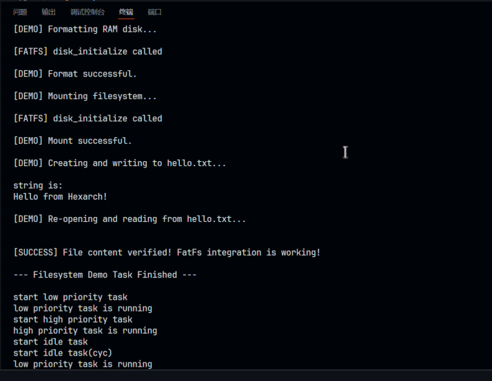

## 项目简介
我们的项目是使用rust重构freeRTOS,并为其添加可选的日志模块和FatFs模块. 首先我们在C语言版本的freeRTOS中添加了FatFS模块以及日志模块,并对C语言版本的源码进行了代码拆分,然后以此为依据用rust重写了FreeRTOS,并在Qemu中进行了模拟和测试,虽然存在一些不足,但是我们大体完成了中期时设定的目标

### 项目背景
FreeRTOS是一个广泛使用的实时操作系统(Real-time operating system, RTOS)，专为嵌入式系统设计，由Richard Barry于2003年首次发布并持续维护至今。FreeRTOS以其简洁、高效、可裁剪的特点，在全球范围内获得了广泛的认可和应用，其优点包括但不限于以下几点：

- 流行性：FreeRTOS是最主流的嵌入式操作系统之一，在全球范围内被广泛采用，拥有庞大的社区支持和活跃的生态系统。

- 功能丰富：FreeRTOS提供了丰富的功能，如任务管理、内存管理、同步机制等，同时还支持文件系统，满足了嵌入式系统的各种需求。

- 性能优异：FreeRTOS实时性能出色，能够满足嵌入式系统的实时性需求。

- 源代码质量：FreeRTOS代码精简、可读性强，易于移植到各种嵌入式平台，对开发者友好。

- 代码量较少: 内核部分的核心只有3个文件(tasks.c queue.c list.c),内核小巧,便于新手开发者进行改写

Rust 是一门系统级别的编程语言，它很好地解决了C/C++等语言在系统级编程中常见的安全性和并发性等问题。

传统的系统级编程语言（如C/C++等）在处理内存安全性和并发性时面对着诸多挑战，如空指针、越界访问和数据竞争等。而Rust的设计目标之一就是通过强大的类型系统和所有权机制解决上述的这些问题，提高代码的安全性和可靠性。

Rust的优点包括但不限于以下几点：

内存安全性：Rust通过所有权系统、借用检查器和生命周期管理等机制，确保在编译时就避免了诸多内存安全问题，如空指针、越界访问、数据竞争等。

并发性：Rust内置了轻量级的线程模型和消息传递机制，使并发编程更加容易和安全。

性能：Rust的性能与C/C++相当，甚至在某些情况下更好。它通过零成本抽象和内联优化等技术实现了高性能。

模式匹配：Rust拥有强大的模式匹配功能，可用于处理复杂的数据结构和状态转换，使代码更加清晰、易于维护。

生态系统：Rust拥有活跃的社区和丰富的库，可以轻松地与其他语言进行集成，还有各种功能强大的工具和框架，如cargo构建系统等。

## C模块添加——文件模块（FatFS）

### 实现的主要功能
- **初始化**：包括磁盘格式化、文件系统的挂载与卸载。
- **文件操作**：如文件的创建、写入、读取、关闭等。
- **目录操作**：如目录的创建、遍历等。

### 带来的好处
- **轻量级设计**：核心仅7个文件，代码体积小，适合嵌入式系统。
- **跨平台兼容性**：在多种嵌入式平台上运行（比如ARM、RISC-V 等等），同时，支持标准的 FAT12/16/32 文件系统格式。
- **模块化与易移植**：FatFS 将文件系统逻辑与底层硬件驱动完全分离，我们在移植的过程中不需要修改核心代码，所以说它的移植难度大大降低
- **丰富的API**：提供标准化的文件/目录操作接口，易于上手。
- **稳定可靠**：经过广泛应用和验证，社区活跃，文档完善。
- **开源免费**：无商业授权限制，便于二次开发。

### 整体实现思路
- **核心文件**：  
  - `ff.c`、`ff.h`、`ffconf.h`（配置）  
  - `diskio.c`、`diskio.h`（配置头文件，通过修改其中的宏定义可以裁剪和定制文件系统功能）  
  - `ffsystem.c`（实现了操作系统的依赖函数，主要处理了内存分配和互斥锁，使FatFS和FreeRTOS更好结合）  
  - `ffunicode.c`（Unicode编码支持模块，提供了字符编码转换功能，支持长文件名和多语言环境）
- **分层架构**：  
  1. **应用层**：对外提供API（如`f_mount`、`f_open`、`f_read`、`f_write`等），用户可以通过简单的函数调用来操作文件系统，不需要了解底层的实现细节
  2. **文件系统逻辑层**：`ff.c`和`ff.h`实现FAT文件系统的核心逻辑。
  3. **底层设备驱动层**：`diskio.c`和`diskio.h`负责与实际存储介质交互。本项目中以RAM磁盘为例，通过内存数组模拟存储设备，便于开发和调试。

### 为什么选择RAM磁盘
- **无需依赖物理设备**，调试和开发更灵活。
- **读写速度快**，资源消耗低。
- **便于后续切换**到MMC/SD卡或USB等实际存储设备，只需修改底层驱动部分。

RAM 使用了系统的内存模拟磁盘，而 MMC 和 USB 需要依赖实际物理设备。

RAM 无需外部硬件，避免硬件配置的干扰，调试过程简单，而且直接访问内存的读写速度相对较高而且稳定，适合实时系统测试。RAM 会面临占用内存过大的问题，我们可以修改 ffconf.h 中的有关参数，修改磁盘扇区数量，使用静态分配代替动态分配（减少内存碎片），精简 FatFS 的功能等等，其实后续实际使用过程，大概都是要改用硬件的，这里选择 RAM 其实只是为了方便快速测试。

### 移植与集成过程
1. **配置**：根据项目需求修改`ffconf.h`中的相关宏定义。
2. **驱动适配**：实现或修改`diskio.c`中的关键函数（如`disk_initialize`、`disk_status`、`disk_read`、`disk_write`、`disk_ioctl`），使其适配RAM磁盘。
3. **功能测试**：在`main.c`中添加测试任务，验证文件系统的初始化、文件/目录操作等功能。

一开始单独部署测试FatFS时采用的是（虚拟磁盘镜像文件），而后续采用的是 RAM 

虚拟磁盘镜像文件存在问题：

1. 需要宿主操作系统的文件系统支持
2. 底层接口需要重写，移植困难
3. 资源需求高（需要文件I/O库支持，增加代码体积与内存占用）

### 运行实例

```
[FatFs]测试开始...
[FatFS]正在格式化磁盘...
[FatFS]格式化成功
[FatFS]正在挂载文件系统...
[FatFS]文件系统挂载成功！
[FatFS]FAT类型: FAT12
[FatFS]测试1: 创建并写入文件'TEST.TXT'...
[FatFS]写入成功: 42字节
[FatFS]测试2: 读取文件'TEST.TXT'...
[FatFS]读取成功: 42字节
[FatFS]文件内容: 这是一个FatFS文件系统测试文件.
[FatFS]测试3: 创建目录'TESTDIR'...
[FatFS]目录创建成功或已存在
[FatFS]测试4: 列出根目录内容...
[FatFS]文件：TEST.TXT，大小: 42字节
[FatFS]目录：TESTDIR
[FatFS]测试完成，卸载文件系统
[FatFS]FatFS集成测试成功完成！
```
## C模块添加--日志模块
- 实现的功能：
  - 提供简化的日志系统，支持错误、信息、调试三个级别
  - 支持整数、十六进制、字符串值的格式化输出
  - 线程安全的日志记录（使用FreeRTOS信号量）
  - 时间戳显示
  - 不依赖复杂的格式化库，适合嵌入式环境
- 带来的好处：
  - 减少调试时间，提供清晰的运行时信息
  - 支持条件编译，可在发布版本中完全禁用以节省资源
  - 内存占用小，使用静态缓冲区避免内存碎片
  - 简单易用的API接口
- 整体如何实现：
  - 核心文件：log.c、log.h、main_blinky.c(测试程序)
- 运行实例：
  - 已录视频...
- 日志可选：
  - 核心配置机制：日志模块的可选性主要通过configUSE_LOG_MODULE宏来控制
```
/* FreeRTOSConfig.h 中的配置 */
#ifndef configUSE_LOG_MODULE
    #define configUSE_LOG_MODULE    1  /* 默认启用日志 */
#endif
```
```
# Makefile 中的配置
ENABLE_LOG ?= 1

ifeq ($(ENABLE_LOG), 1)
    CPPFLAGS += -DconfigUSE_LOG_MODULE=1
    $(info 编译配置: 日志模块已启用)
else
    CPPFLAGS += -DconfigUSE_LOG_MODULE=0
    $(info 编译配置: 日志模块已禁用)
endif
```
用户可以通过以下方式控制：
make ENABLE_LOG=1 - 启用日志
make ENABLE_LOG=0 - 禁用日志
优化效果：
启用时：
编译器包含完整的日志实现代码
提供线程安全的日志功能
支持不同日志级别、时间戳等功能
增加代码体积和运行时开销
禁用时：
所有日志调用被替换为空宏操作do {} while(0)
编译器优化会完全移除这些空操作
不占用任何ROM/RAM空间
日志模块运行时零开销
这种设计非常适合嵌入式系统，特别是资源受限的环境，开发阶段可以启用详细日志进行调试，发布版本可以完全禁用以节省资源。
- 不足之处：
  - 结果输出媒介单一，目前日志模块的测试结果只可输出到终端上

## C重构
- 我们并没有对于内部算法, 运行逻辑进行优化, 而是进行了FreeRTOS内部各部分的解耦, 最终成功对需要拆分的queue.c, tasks.c, timers.c三个文件中的所有函数进行了分类，拆分timers.c函数并成功运行. 
整体变化:(原来的文件函数情况→现在的)
- queue.c
  queue_base.c：队列的基本操作实现
  queue_mutex.c：互斥量与信号量相关实现
  queue_isr.c：中断相关队列操作
  queue_registry.c：队列注册表相关
  queue_private.c：私有静态函数实现（如数据拷贝、锁操作等）

- tasks.c
  task_create.c：任务的创建与删除
  task_schedule.c：任务调度与切换
  task_delay.c：任务延时与挂起
  task_priority.c：任务优先级与状态管理
  task_hook.c：任务钩子与统计
  task_private.c：私有静态函数实现

- 由于最终我们是要在rust版本的freeRTOS中将代码进行模块化,所以我们实质上并没有真的拆分C代码,只是将每个C文件中的各个数据结构,函数等进行了归类,方便我们对其进行rust的模块化
- 对应关系(以tasks为例)
mod.rs - 模块组织文件
职责： 作为模块的入口点，组织和管理子模块
  声明子模块（types, creation, scheduler, control）
  使用 #[macro_use] 导出各模块的宏
  重新导出所有子模块的公共接口，提供统一的访问点

types.rs - 类型定义模块
职责： 定义任务系统的基础类型和数据结构主要功能：
  类型别名定义： StackType_t, TCB_t_link, TaskHandle_t 等
  核心数据结构： tskTaskControlBlock（任务控制块）
  枚举类型： eTaskState（任务状态枚举）
  辅助结构： TimeOut（超时结构）
  全局变量： 调度器状态、tick计数、任务数量等
  常量定义： taskEVENTLISTITEM_VALUE_IN_USE 等

creation.rs - 任务创建模块
对应（task_create.c）
职责： 负责任务的创建和初始化主要功能：
  静态任务创建： xTaskCreateStatic() - 使用预分配的栈和TCB
  动态任务创建： xTaskCreate() - 动态分配栈和TCB
  任务初始化： prvInitialiseNewTask() - 初始化新任务的TCB
  就绪列表管理： prvAddNewTaskToReadyList(), prvAddTaskToReadyList()
  优先级记录： taskRECORD_READY_PRIORITY()
核心流程：
  分配/使用栈空间
  创建/使用TCB
  初始化任务参数（名称、优先级等）
  设置栈指针和入口点
  将任务添加到就绪列表

scheduler.rs - 调度器核心模块
对应（task_schedule.c）
职责： 实现任务调度和调度器核心逻辑主要功能：
  调度器启动： vTaskStartScheduler() - 启动调度器，创建空闲任务
  空闲任务： prvIdleTask() - 系统空闲时运行的任务
  优先级选择： taskSELECT_HIGHEST_PRIORITY_TASK(), taskSELECT_HIGHEST_PRIORITY()
  任务切换： taskYield() - 主动让出CPU
  时间管理： xTaskIncrementTick() - 增加系统tick，处理延迟任务
  延迟管理： prvAddCurrentTaskToDelayedList(), taskSWITCH_DELAYED_LISTS()
  任务延迟： vTaskDelay(), xTaskDelayUntil()
关键算法：
  最高优先级任务选择算法
  延迟任务唤醒机制
  时间片轮转调度

control.rs - 任务控制模块
对应（task_delay.c、task_priority.c、task_hook.c、task_private.c）
职责： 提供任务生命周期管理和控制功能主要功能：
  临界区管理： vTaskEnterCritical(), vTaskExitCritical()
  任务挂起/恢复： vTaskSuspend(), vTaskResume()
  任务删除： vTaskDelete()
  调度器挂起/恢复： vTaskSuspendAll(), vTaskResumeAll()
  优先级管理： vTaskPrioritySet(), uxTaskPriorityGet()
  互斥锁优先级继承： xTaskPriorityInherit(), xTaskPriorityDisinherit()
  事件列表管理： xTaskRemoveFromEventList(), vTaskPlaceOnEventList()
  超时处理： vTaskSetTimeOutState(), xTaskCheckForTimeOut()
  任务查询： pcTaskGetName()
控制流程：
  任务状态转换（就绪 ↔ 运行 ↔ 阻塞 ↔ 挂起）
  优先级调整和继承
  事件等待和唤醒
  超时检测和处理

其他的模块,如list,由于list是freeRTOS中最底层的一个数据结构,其中的功能主要就是增删改查,因此没有必要将其再度拆分,故保留list.rs为一个完整的整体;queue则拆成了queue模块和semr模块,原因是freeRTOS的信号量是用queue来实现的,因此queue.c中既包含了任务队列相关的操作,也包含了信号量的相关操作,秉持着模块化的思想,我们将其进行了拆分
## Rust改写

### 顶层结构与启动流程
- start.S（汇编启动文件）：这是系统上电后执行的第一段代码，它的核心职责非常纯粹：
  - 设置初始栈指针：为后续的rust代码执行环境准备一个有效的栈空间
  - 跳转到rust入口：完成最基本的硬件初始化后，通过call指令跳转到rust代码的入口点
- fake_rom.lds（链接器脚本）：该文件指导链接器如何组织编译后的各个代码和数据段，生成最终的可执行文件。精确定义了内存布局：
  - .text段，.rodata段，.data段，.bss段
  - 定义了堆和栈起始和结束地址，为动态内存分配和任务栈的创建提供依据
- main.rs（主函数）：这是代码主要执行的部分，也是模拟后显示的部分。
### base模块：内核基础与配置
- FreeRTOSconfig.rs：这是freertos官方的FreeRTOSConfig.h的rust版本，用于配置内核。通过pub const定义了一系列编译常量，用于裁剪和配置内核功能。
- projdefs.rs：等同于C版本中的projdefs.h。项目范围内的通用常量和类型别名。
- allocator.rs:实现了全局动态内存分配器，在no_std环境下必须提供一个堆内存分配器的实现，定义堆的起始和结束位置，为整个系统提供malloc和free的能力
- kernel.rs：包含了一些核心的内核全局函数和宏，是其他模块都会依赖的东西
### tasks模块：任务管理与调度
RTOS的心脏，负责任务的创建、调度、状态管理和上下文切换。
- types.rs:定义了与任务相关的所有核心数据结构
  - tskTaskControlBlock(TCB):这是描述一个任务所有信息的结构体，包括任务状态，栈顶指针，任务名称等等
  - TaskHandle_t：在rust中，任务句柄被安全地定义为pub type TaskHandle_t = Arc<RwLock<tskTaskControlBlock>>
    - Arc：原子引用计数智能指针，允许多个地方（如就绪列表、阻塞列表、用户代码）安全地“拥有”同一个TCB的引用，当所有引用都消失的时候，TCB才会被销毁
    - RwLock：读写锁，确保了对TCB内部数据的并发访问是安全的，写必须独占，读取可以并发。防止数据竞争creation.rs：负责任务的创建
- creation.rs：负责任务的创建
  - xTaskCreate：实现了动态任务创建，它会：
    - 从我们定义的堆中分配任务栈和TCB
    - 调用prvIntialiseNewTask 初始化TCB，包括设置任务入口函数、名称、优先级等。
    - 初始化任务的栈帧
  - xTaskCreateStatic：实现了静态任务创建，任务栈和TCB的内存由编译时提供，避免运行时动态内存分配
- scheduler.rs：实现了调度器
  - vTaskStartScheduler()：启动调度器的函数。它会创建空闲任务，配置定时器以产生系统时钟节拍，并启动第一个任务的执行，将CPU的控制权移交给调度器
  - 调度逻辑：调度器维护多个优先级的就绪列表（READY_TASK_LISTS）。当需要进行任务切换时（例如，在时钟中断或任务阻塞后），它会从最高优先级的就绪列表中选择下一个要运行的任务，并执行上下文切换。
- control.rs：包含任务控制相关的API。
  - vTaskDelay/xTaskDelayUntil：将当前任务置于阻塞状态一段制定的时间。实现上，它会将任务从就绪列表中删除，并插入到延时列表（DELAYED_TASK_LIST）中。
  - vTaskSuspend/vTaskResume：挂起和恢复任务。通过在不同状态列表（如挂起列表）之间移动任务的TCB来实现
  - vTaskEnterCritical/vTaskExitCritical：进入和退出临界区，通过禁用和启用中断来实现，确保一段代码的原子执行。
### list模块
- FreeRTOS大量使用一种高效的双向链表来管理任务，我们用Rust对其进行了安全的封装
- list.rs：
  - 数据结构：定义了ListT（链表本身）和ListItemT（链表节点）。同样地，节点之间的链接使用了Weak和Arc来代替原始指针，防止了悬垂指针的循环引用导致的内存泄漏问题。
  - API：提供了vListRemove等一系列与C版本兼容的链表操作函数，这些函数内部封装了所有权的移动和借用检查，对外暴露了安全易用的接口，例如，就绪列表，阻塞列表，挂起列表都是使用的ListT
### queue、semphr、event_group：任务间通信
- 这些模块提供了任务间同步与通信的核心机制
- queue.rs：队列是FreeRTOS中最基础的IPC机制。
  - QueueDefinition：队列的核心结构体，包含了存储区指针、项目大小、消息数量以及两个重要的列表：
    - xTasksWaitingToSend：因队列满而阻塞的发送任务列表
    - xTasksWaitingToReceive：因队列空而阻塞的接收任务列表
  - xQueueSend（）：当任务向一个已满的队列发送数据时，如果设置了阻塞时间，该任务的TCB会被从就绪列表移除，并添加到队列的xTaskWaitingToSend列表中，然后触发一次任务调度。
  - xQueueReceive（）：当任务从一个空队列接收数据时，同样会被阻塞并加入到xTaskWaitingToReceive列表，当另一个任务向该队列发送数据后，会检查此列表，唤醒其中等待的任务（即将其移回就绪列表）。
  - 锁机制：对队列内部数据访问，都通过taskENTER_CRITICAL!和taskEXIT_CRITICAL！宏来保护，确保多任务并发操作队列的原子性
- semphr/semphr.rs：信号量和互斥锁。在FreeRTOS中，它们是基于队列实现的特例。
  - xSemaphoreCreateBinary（）：创建一个二进制信号量，本质上是一个长度为1的队列
  - xSemaphoreCreateMutex（）：创建一个互斥锁，它也是一个长度为1的队列，但额外包含了优先级继承的逻辑，以防出现优先级反转的问题
  - xSemaphoreTake（）/xSemaphoreGive（）：获取和释放信号量/互斥锁，其内部实现最终调用的是xQueueReceive和xQueueSend
- event_group/event_group.rs：事件组，提供了一种多对多的任务同步机制。任务可以等待一个或多个事件的发生，其实现内部也维护了一个等待任务列表，当事件被设置时，会遍历该列表，检查是否有任务等待条件被满足，并唤醒它们。
portable目录：平台移植
这个目录包含所有与具体CPU架构和开发板相关的代码，使得内核核心代码可以独立于硬件平台
- portmacro.rs：定义了与平台相关的宏和类型
- portable.rs：实现了上下文切换的核心函数pxPortInitialiseStack（初始化任务栈）和xPortStartScheduler（启动调度器的底层实现）。上下文切换通过内联汇编（asm！）实现，精确地保存和恢复所有通用寄存器。
- riscv_virt.rs：针对QEMU的 virt RISC-V虚拟开发板的特定代码：
  - vSendString：实现了通过向NS16550 UART串口设备的内存映射地址写入数据，来在QEMU控制台打印字符串的函数，也是一种调试手段
  - 中断处理


## Rust模块添加
我们同样把fatfs的C语言版本加进了rust版的FreeRTOS中，如同c版本的一样，同样是使用内存模拟磁盘，主要增加了fs文件夹，其中的rust代码是改写自fatfs官方所提供的c语言文件，加入后，对build.rs进行修改，并且在用到的地方引入mod fs，即可运行这个文件系统。
进行了简单的测试，在这里，设置了三个任务，优先级由高到低，把文件系统的任务优先级设为最高，并且在次优先级的两个任务中，在运行一段时间后都挂起，所以，在高优先级任务启动后，会转入空闲任务（这个任务是在没有任务执行时，自动执行的，这是一种最大化利用率的方式，空闲任务可以干一些用户自己设计的事），然后低优先级任务运行，挂起后会，再次转入其他任务，实现两个任务交替完成的效果。
结果如下图:



## 改写后的测试结果
- 首先测试了两个相同优先级的任务,发现调度器可以正常时间片轮转调度这两个任务
- 其次测试了两个优先级不同的任务,在高优先级的任务每执行一次后主动挂起一段时间,低优先级的任务能否被调度器调度,发现每执行一次高优先级的任务,就会执行多次低优先级的任务
- 然后又测试了是否正常,创建了两个任务,一个是释放信号量,一个是获取信号量,调度方式是定时器中断调度,发现有获取成功和失败,也有释放成功和失败,这都是预期结果,因为比如当释放信号量的任务还没有释放的时候就已经触发了定时器中断,那么获取信号量的任务当然获取失败
- 上述测试都在PPT中录制有测试视频

## 几个改写过程中的关键步骤
- nostd环境下,我们需要提供一个全局内存分配器,这样才能进行动态内存分配,Vec Arc Weak等都需要动态内存分配,这里我们主要是使用了一个第三方库buddy_system_allocator来实现的
- 改写前期逃不开的一个话题是C和rust的混合编译问题,关于rust如何调用C语言,我们采用的方法是使用bindgen生成C语言的FFI提供给rust调用,前提是C语言的源码已经被编译成静态库,这一部分的详述为
Bindgen + cc +libc实现rust调用C语言的具体步骤(默认使用的操作系统为linux)
1. 下载bindgen: 在bash里输入cargo install bindgen-cli
2. 下载依赖:sudo apt install libclang-dev
3. 创建cargo项目:cargo new your-project-name
4. 在生成的cargo.toml中添加 libc 和 cc 库(CC库是用来build rust之前将所需的C代码编译了)
5. 在项目根目录(并非src)中创建build.rs文件(这里假设在src中已经创建好了test.c以及test.h文件)
```
// in build.rs
fn main(){
cc::Build::new()
    .file("src/test.c") // 如果有更多,就继续file("")即可
  //.file("src/more.c")
    .compile("wrapper");
}
```
```
//test.c以及test.h如下
typedef struct TestC
{
    /* data */
    int foo;
    char c;
    float f;
}Testc;

Testc init_test();
int out_int(int a);
char out_char(char a);
float out_float(float f);

#include "test.h"

Testc init_test(){
    Testc test;
    test.foo = 10;
    test.c = '#';
    test.f = 3.1415;
    return test;
}
int out_int(int a){
    return a * 3;
}
char out_char(char a){
    return a + 1;
}
float out_float(float f){
    return f;
}
```
6. 在src中创建wrapper.h并在其中include需要的库,这里我们需要的是test
7. 在bash中使用bindgen生成链接:bindgen wrapper.h -o wrapper.rs //这会根据wrapper中包含的库文件生成一个链接文件wrapper.rs
8. 至此,我们的项目中应该生成了一个wrapper.rs文件,你可以点进去查看,它将C的静态库与rust进行了绑定,让我们可以在rust中调用C, 为了调用,我们需要使用rust 的 mod
```
// rust main.rs
use wrapper::{init_test, out_char, out_float, out_int};

mod wrapper; //使用mod 将wrapper库包含进来,使得我们可以调用
extern crate libc;
use libc::{c_char, c_int, c_float};
fn main() {
    println!("Hello, world!");
    //C语言的库需要显式的使用 unsafe 块 包裹, 这样才可以正确的调用
    unsafe{
        let t = init_test();
        println!("{:?}",t);

        let foo: c_int = out_int(t.foo);
        println!("{}",foo);

        let c : c_char = out_char(t.c);
        println!("{}",c);

        let f: c_float = out_float(t.f);
        println!("{}",f);
    }
}
```
9. 构建项目,测试运行,回到项目根目录:cargo build
10. 如果没有报错,则恭喜你构建项目成功
你也可以使用`cargo check`来检查是否可以编译
11. 如果前10步成功完成,则使用cargo run来运行代码,如果正确运行,你应该可以看到:
```
   Compiling rustbindgenc v0.1.0 (/home/kyomoto/repo/rust/rustbindgenc)
    Finished `dev` profile [unoptimized + debuginfo] target(s) in 0.16s
     Running `target/debug/rustbindgenc`
Hello, world!
TestC { foo: 10, c: 35, f: 3.1415 }
30
36
3.1415
```
## 几个问题
1. 为什么选择将C语言版本的FatFS加入系统,而不是用rust版本或者重写一个rust版本的
我们在中期的时候就打算如果有多余的精力,就尝试自己写rust版本的FatFS,但是改写freeRTOS几乎消耗了我们的所有精力,我们确实没有时间再对FatFS进行改写,不过我们找到了rust版本的fatfs,但是这个库不知为何无法添加,因此我们只能选用C语言版本的FatFS
1. 为什么最终没有上板成功
我们选的这一套DEMO是官方库中的专门用于Qemu模拟的DEMO,因为在Qemu模拟比较方便我们运行调试,所以我们改写的时候采用了这一套DEMO,但是一开始买的是stm32的板子,freeRTOS每一套DEMO的portable接口都大有不同,在这上边花费我们的精力不是我们应该主要考虑的内容,因此我们最终决定先忽略上板的问题,先完成改写,但是完成改写后已经要进行答辩了,我们也没有多余精力去适配上板了
1. 中期的时候我们本来打算增加FatFS模块,日志模块,还有网络模块和CLI模块,为何最后只添加了FatFS和日志
一方面我们能力和精力确实有限,光是适配FatFS和日志+改写freeRTOS就已经花了很多时间,另一方面是我们对于硬件的了解太少了,在nostd环境下实现网络模块我们有点不知所措,CLI模块也是这个原因
1. 改写后的系统性能上如何
我们在中期的时候就提过,由于我们要添加更多的模块,因此性能方面并不是我们要考虑的事情,因为添加更多模块就意味着要牺牲部分性能,不过对于freeRTOS本身的内核改写,性能上应该是没有什么损失,有损失的地方可能就是由于我们在rust为了安全性,选择使用Arc Weak RwLock机制来包裹裸指针对其进行操作,这相比于C语言直接操作裸指针来说应该是需要一部分额外开销

## 困难与解决
- 调试与错误处理：
  - 在开发裸机程序时，由于nostd环境，我们失去了操作系统提供的一切便利，包括最基本的 printf。当系统无法启动、或在某个地方崩溃时，我们就像在黑暗中摸索，没有任何信息反馈。
  - 调试:GDB 远程调试: 首先是需要安装gdb调试工具（这里不是普通的gdb工具，而是适配RISC-V架构的）通过在 makefile 中配置 make debug 命令，可以启动一个等待 GDB 连接的 QEMU 实例。我们使用 riscv32-unknown-elf-gdb 连接到该实例，可以进行设置断点、单步执行、查看内存和寄存器等所有标准调试操作。
  - 串口打印: 我们实现了简单的串口输出功能，通过 rustPrint FFI 函数，可以在 QEMU 控制台打印调试信息，这是最直接有效的调试手段。
  - 编译时错误: 大部分逻辑错误、类型不匹配、数据竞争和内存安全问题，都在编译阶段被 Rust 编译器发现并报告，极大地减少了运行时 bug，这也是rust语言的优势之一，对于出现的编译错误，如果是一些简单的语法错误，大多数情况下，编译器都会有精确的输出和“预测”的解决方案。
  - Panic 处理: 我们定义了一个全局的 panic_handler。当程序遇到不可恢复的错误（panic）时，会进入该处理器，它会通过串口打印出panic，然后进入死循环，防止系统继续执行错误代码。
- 全局可变状态的管理: RTOS 内核中存在大量全局状态（如任务列表、调度器状态）。在 C 中通常使用全局变量，但这在 Rust 中是极其不安全的。
  - 解决方案: 我们采用 lazy_static! 宏来安全地初始化全局静态变量，并使用 spin::Mutex 或 RwLock 对其进行封装，确保了对全局状态的访问是互斥和线程安全的。
- C 语言精巧数据结构的 Rust 安全重构
  - FreeRTOS 的性能优势部分来源于其精巧的数据结构，特别是其侵入式双向链表。在 C 语言中，链表节点直接嵌入在任务控制块（TCB）中，通过指针操作直接链接，非常高效但也极易出错（如错误的指针操作导致链表断裂或产生循环）。用 Rust 的标准库集合（如 Vec 或 LinkedList）直接替换，可能会有性能损失或不符合 RTOS 的需求。
  - 我们的解决方案: 我们重新设计并实现了安全的、符合 Rust 范式的链表。
    - 所有权与智能指针: 我们没有使用裸指针，而是使用了 Arc<RwLock<ListItemT>> 和 Weak<RwLock<ListItemT>>。Arc 用于强引用（如链表头指向第一个节点），Weak 用于弱引用（如节点间的 prev 指针），这巧妙地解决了循环引用问题，防止了内存泄漏。RwLock 则保证了对节点内容并发访问的安全性。
    - 封装为模块: 我们将整个链表的实现封装在 list 模块中，对外提供与 C 版本功能一致的安全 API（如 vListInsertEnd），而将所有复杂的指针和所有权操作隐藏在模块内部。
    - 在上面举过双向链表的例子，这就是一个最典型的C语言数据结构

