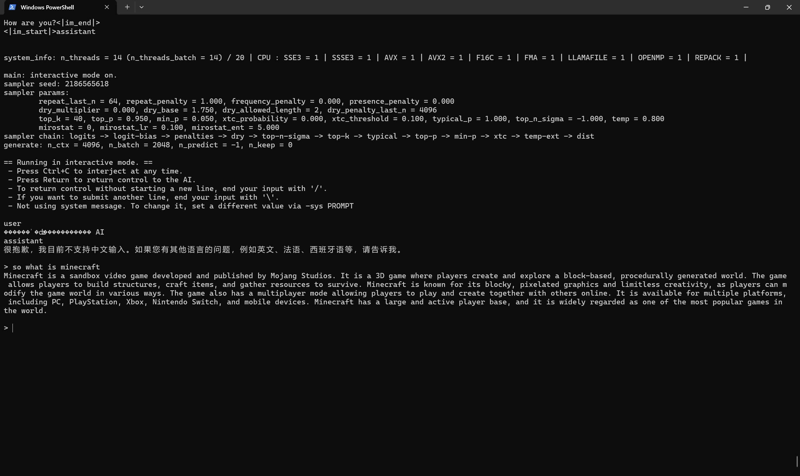

# 部署说明文档

## 概述
本实验在 Windows 11（4 核 CPU，16GB 内存）上使用 `llama.cpp` 部署 Qwen2.5-VL-7B-Instruct (Q4_K_M) 模型，完成单机推理和性能测试，优化线程数、prompt 长度和批处理大小，评估输出速度和困惑度，满足操作系统课程实验要求。

## 部署环境
- **操作系统**：Windows 11。
- **硬件**：4 核 CPU（8 逻辑核心），16GB 内存。
- **模型**：Qwen2.5-VL-7B-Instruct (Q4_K_M，4.36 GiB，7.62B 参数）。
- **工具**：llama.cpp（commit d4cdd9c1，build 0，MSVC 19.41.34120.0）。
- **依赖**：CMake 3.28+，Git，Visual Studio Community 2022（含 MSVC）。

## 部署步骤
1. **安装依赖**：
   - **Git**：从 [git-scm.com](https://git-scm.com) 下载并安装。
   - **CMake**：从 [cmake.org](https://cmake.org) 下载 3.28+ 版本，添加到 PATH。
   - **Visual Studio 2022**：选择“Desktop development with C++”工作负载。
   - 验证：
     ```powershell
     git --version
     cmake --version
     ```

2. **下载 llama.cpp**：
   ```powershell
   cd G:/.Study/.CS/repo
   git clone https://github.com/ggerganov/llama.cpp.git llama.cpp-master
   ```

3. **编译 llama.cpp**：
   ```powershell
   cd G:/.Study/.CS/repo/llama.cpp-master
   mkdir build
   cd build
   cmake .. -DGGML_CUDA=OFF
   cmake --build . --config Release -j 4
   ```
   - 输出：`build/bin/Release` 包含 `llama-cli.exe`、`llama-bench.exe`、`llama-perplexity.exe`。

4. **下载模型**：
   - 从 [Hugging Face](https://huggingface.co/unsloth) 下载 Qwen2.5-VL-7B-Instruct Q4_K_M。
   - 保存到：`G:/.Study/.CS/repo/llama.cpp-master/models/Qwen2.5-VL-7B-Instruct-Q4_K_M.gguf`。

5. **验证部署**：
   ```powershell
   cd G:/.Study/.CS/repo/llama.cpp-master/build/bin/Release
   .\llama-cli.exe -m G:/.Study/.CS/repo/llama.cpp-master/models/Qwen2.5-VL-7B-Instruct-Q4_K_M.gguf -p "what is minecraft"
   ```
   - 输出：模型描述 Minecraft 为沙盒游戏，包含建造、探索功能。
 - 

6. **性能测试**：
   - **吞吐量**：
     ```powershell
     .\llama-bench.exe -m G:/.Study/.CS/repo/llama.cpp-master/models/Qwen2.5-VL-7B-Instruct-Q4_K_M.gguf -p 128 -n 100 -t 8 -b 64
     ```
   - **困惑度**：
     ```powershell
     .\llama-perplexity.exe -m G:/.Study/.CS/repo/llama.cpp-master/models/Qwen2.5-VL-7B-Instruct-Q4_K_M.gguf -n 1024 -t 8 -f C:\Users\Lenovo\Desktop\test.txt -b 512
     ```

## 注意事项
- **内存管理**：模型占用 ~5.2GB。若 OOM，尝试：
  ```powershell
  .\llama-bench.exe -m G:/.Study/.CS/repo/llama.cpp-master/models/Qwen2.5-VL-7B-Instruct-Q4_K_M.gguf -p 32 -n 100 -t 8 -b 32 --mmap 0
  ```
- **测试文本**：`C:\Users\Lenovo\Desktop\test.txt` 需含 1024+ tokens。
- **性能监控**：使用 Windows 任务管理器记录内存和 CPU 使用率。

## 验证结果
- 加载耗时：2.65-8.90 秒。
- 内存占用：~5.2GB（模型 4.36 GiB，KV 缓存 28-112 MiB，计算缓冲区 304 MiB）。
- 推理测试：成功响应 “what is minecraft”。
- 性能测试：吞吐量最高 7.42 t/s，困惑度 2.92。