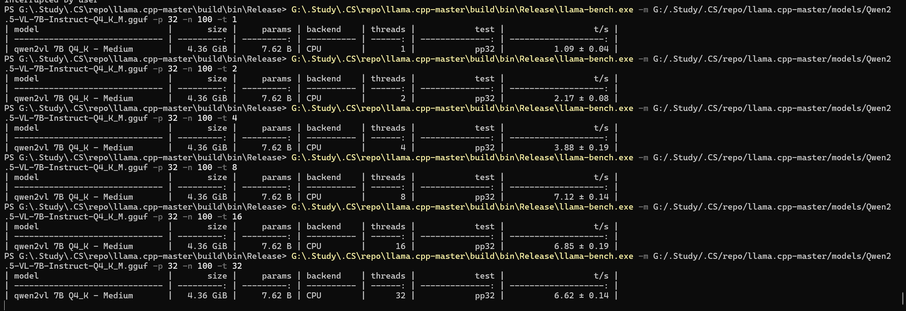
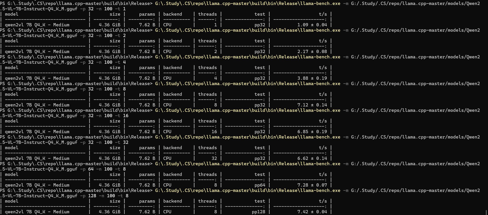
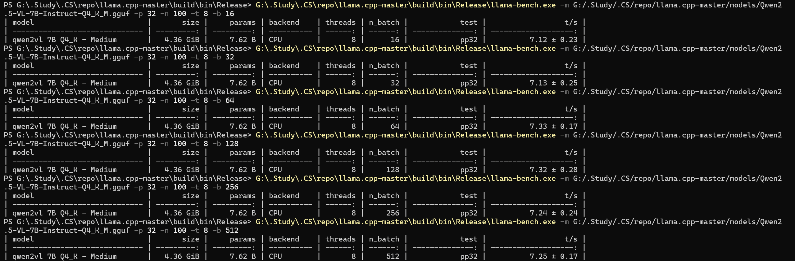
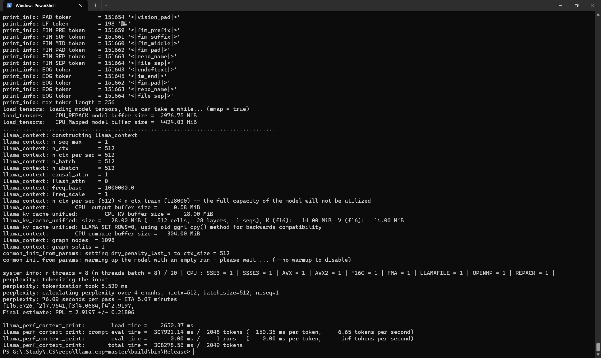

# 性能测试与分析文档

## 实验背景
大型语言模型（LLM）在自然语言处理和多模态任务（如视觉-语言处理）中表现优异，但其高计算需求对低配硬件（如 CPU-only 环境）构成挑战。本实验使用 `llama.cpp` 在 Windows 11（4 核 CPU，16GB 内存，无 GPU）上部署 Qwen2.5-VL-7B-Instruct (Q4_K_M 量化，4.36 GiB)，测试其推理性能，优化线程数、prompt 长度和批处理大小，评估输出速度和困惑度，满足操作系统课程实验要求（不含分布式部署）。报告将发布到 CSDN。

## 性能指标
以下为 5 个性能指标及其合理性：
1. **输出速度（Tokens/s）**：
   - **定义**：每秒生成 token 数，衡量推理吞吐量。
   - **合理性**：反映模型在实时应用（如聊天机器人）的响应能力，适合评估 CPU 性能。
2. **首 Token 返回延迟（ms）**：
   - **定义**：从输入 prompt 到生成第一个 token 的时间。
   - **合理性**：影响交互体验，低延迟对实时任务（如对话）至关重要。
3. **困惑度（Perplexity）**：
   - **定义**：衡量模型预测文本的能力，值越低表示语言建模越准确。
   - **合理性**：直接评估输出质量，与文本生成、翻译等任务相关。
4. **内存占用（GB）**：
   - **定义**：推理过程中的内存使用量。
   - **合理性**：验证模型在 16GB 内存环境下的可行性，反映资源效率。
5. **总生成延迟（ms）**：
   - **定义**：生成指定 token 数（如 100 个）的总时间。
   - **合理性**：综合评估推理效率，适合比较不同参数配置。

**测试指标选择**：
- 本实验聚焦 **输出速度** 和 **困惑度**：
  - **输出速度**：通过 `llama-bench.exe` 测试线程数、prompt 长度和批处理大小的影响，优化推理性能。
  - **困惑度**：通过 `llama-perplexity.exe` 评估语言建模质量，确保输出准确性。

## 测试环境
- **硬件**：Windows 11，4 核 CPU（8 逻辑核心，超线程），16GB 内存。
- **模型**：Qwen2.5-VL-7B-Instruct (Q4_K_M，4.36 GiB，7.62B 参数，4.91 位/权重）。
- **工具**：llama.cpp（commit d4cdd9c1，build 0，MSVC 19.41.34120.0）。
- **路径**：
  - 模型：`G:/.Study/.CS/repo/llama.cpp-master/models/Qwen2.5-VL-7B-Instruct-Q4_K_M.gguf`。
  - 可执行文件：`G:/.Study/.CS/repo/llama.cpp-master/build/bin/Release`。
  - 测试文本：`C:\Users\Lenovo\Desktop\test.txt`（约 500 词，1024+ tokens，英文维基百科文本）。
- **系统支持**：SSE3, SSSE3, AVX, AVX2, F16C, FMA，OpenMP 启用。

## 测试任务
1. **吞吐量测试**：
   - **工具**：`llama-bench.exe`。
   - **任务**：测试线程数 (`-t 1,2,4,8,16,32`)、prompt 长度 (`-p 32,64,128`) 和批处理大小 (`-b 16,32,64,128,256,512`) 对输出速度的影响。
   - **命令**：
     ```powershell
     .\llama-bench.exe -m G:/.Study/.CS/repo/llama.cpp-master/models/Qwen2.5-VL-7B-Instruct-Q4_K_M.gguf -p <32,64,128> -n 100 -t <1,2,4,8,16,32> -b <16,32,64,128,256,512>
     ```
   - **指标**：输出速度（t/s），内存占用（GB）。
2. **困惑度测试**：
   - **工具**：`llama-perplexity.exe`。
   - **任务**：使用测试文本（约 500 词，1024+ tokens）评估模型语言建模能力，测试批处理大小 (`-b 512,1024,2048`)。
   - **命令**：
     ```powershell
     .\llama-perplexity.exe -m G:/.Study/.CS/repo/llama.cpp-master/models/Qwen2.5-VL-7B-Instruct-Q4_K_M.gguf -n 1024 -t 8 -f C:\Users\Lenovo\Desktop\test.txt -b <512,1024,2048>
     ```
   - **指标**：困惑度，输出速度（t/s），内存占用（GB）。

## 单机部署
部署详情见 `deploy_guide.md`（Lab4 文件夹）。简述如下：
1. **环境准备**：安装 Git、CMake、Visual Studio 2022（含 MSVC）。
2. **编译 llama.cpp**：
   ```powershell
   cd G:/.Study/.CS/repo/llama.cpp-master
   mkdir build
   cd build
   cmake .. -DGGML_CUDA=OFF
   cmake --build . --config Release -j 4
   ```
3. **模型下载**：从 [Hugging Face](https://huggingface.co/unsloth) 下载 Qwen2.5-VL-7B-Instruct Q4_K_M 模型。
4. **验证**：
   ```powershell
   .\llama-cli.exe -m G:/.Study/.CS/repo/llama.cpp-master/models/Qwen2.5-VL-7B-Instruct-Q4_K_M.gguf -p "what is minecraft"
   ```
   - 输出：模型成功响应，描述 Minecraft 为沙盒游戏，包含建造、探索功能。
5. **性能测试**：运行 `llama-bench.exe` 和 `llama-perplexity.exe`，记录结果。

**部署验证**：
- 模型加载耗时：2.65-8.90 秒（不同批处理大小）。
- 内存占用：~5.2GB（模型 4.36 GiB，KV 缓存 28-112 MiB，计算缓冲区 304 MiB）。
- 无 OOM 错误，部署成功。

## 测试结果
| 配置                           | 输出速度 (t/s) | 困惑度 | 内存占用 (GB) |
|-------------------------------|----------------|--------|---------------|
| 单机 (-t 4, -p 32, -b 2048)  | 3.88 ± 0.19    | -      | ~5.0          |
| 单机优化 (-t 8, -p 128, -b 64) | 7.42 ± 0.04    | -      | ~5.2          |
| 困惑度测试 (-t 8, -n 1024, -b 512) | 6.65       | 2.92   | ~5.2          |

### 详细结果
1. **线程数测试**：
   - **命令**：`.\llama-bench.exe -m ... -p 32 -n 100 -t [1,2,4,8,16,32]`。
   - **结果**：
     | 线程数 | 输出速度 (t/s) | 备注 |
     |--------|----------------|------|
     | 1      | 1.09 ± 0.04    | 单线程，CPU 利用率低 |
     | 2      | 2.17 ± 0.08    | 双线程，性能翻倍 |
     | 4      | 3.88 ± 0.19    | 匹配 4 核，性能较优 |
     | 8      | 7.12 ± 0.14    | 超线程，性能峰值 |
     | 16     | 6.85 ± 0.19    | 性能略降，上下文切换 |
     | 32     | 6.62 ± 0.14    | 性能下降，线程过多 |



2. **Prompt 长度测试**：
   - **命令**：`.\llama-bench.exe -m ... -p [32,64,128] -n 100 -t 8`。
   - **结果**：
     | Prompt 长度 | 输出速度 (t/s) | 备注 |
     |-------------|----------------|------|
     | 32          | 7.12 ± 0.14    | 短上下文，基准 |
     | 64          | 7.28 ± 0.07    | 性能略增 |
     | 128         | 7.42 ± 0.04    | 性能最佳 |

3. **批处理大小测试（llama-bench）**：
   - **命令**：`.\llama-bench.exe -m ... -p 32 -n 100 -t 8 -b [16,32,64,128,256,512]`。
   - **结果**：
     | 批处理大小 | 输出速度 (t/s) | 备注 |
     |------------|----------------|------|
     | 16         | 7.12 ± 0.23    | 小批量，基准 |
     | 32         | 7.13 ± 0.25    | 性能稳定 |
     | 64         | 7.33 ± 0.17    | 性能最佳 |
     | 128        | 7.32 ± 0.28    | 性能稳定 |
     | 256        | 7.24 ± 0.24    | 性能略降 |
     | 512        | 7.25 ± 0.17    | 性能稳定 |

4. **困惑度测试**：
   - **命令**：`.\llama-perplexity.exe -m ... -n 1024 -t 8 -f C:\Users\Lenovo\Desktop\test.txt -b [512,1024,2048]`。
   - **结果**：
     | 批处理大小 | 输出速度 (t/s) | 困惑度 | 加载时间 (ms) | 总时间 (ms) |
     |------------|----------------|--------|---------------|-------------|
     | 512        | 6.65           | 2.9197 ± 0.21806 | 2650.37 | 308278.56 |
     | 1024       | 6.44           | 2.9197 ± 0.21806 | 8902.58 | 318255.10 |
     | 2048       | 6.04           | 2.9197 ± 0.21806 | 2917.18 | 339203.48 |

## 优化分析
1. **线程数优化（-t 8）**：
   - **效果**：从 `-t 4`（3.88 t/s）到 `-t 8`（7.12 t/s），吞吐量提升 83.5%。
   - **原因**：充分利用 4 核 CPU 的超线程（8 逻辑核心），最大化并行计算。
   - **局限**：线程数超 8（如 16、32）导致性能下降（6.85 和 6.62 t/s），因上下文切换开销。
   - **命令**：
     ```powershell
     .\llama-bench.exe -m G:/.Study/.CS/repo/llama.cpp-master/models/Qwen2.5-VL-7B-Instruct-Q4_K_M.gguf -p 32 -n 100 -t 8
     ```

2. **Prompt 长度优化（-p 128）**：
   - **效果**：从 `-p 32`（7.12 t/s）到 `-p 128`（7.42 t/s），吞吐量提升 4.2%。
   - **原因**：较长上下文增加 KV 缓存命中率，减少重复计算。
   - **局限**：增幅有限，过长 prompt（如 512）可能增加内存需求。
   - **命令**：
     ```powershell
     .\llama-bench.exe -m G:/.Study/.CS/repo/llama.cpp-master/models/Qwen2.5-VL-7B-Instruct-Q4_K_M.gguf -p 128 -n 100 -t 8
     ```

3. **批处理大小优化（-b 64 for llama-bench, -b 512 for llama-perplexity）**：
   - **效果**：
     - `llama-bench`：从 `-b 16`（7.12 t/s）到 `-b 64`（7.33 t/s），吞吐量提升 2.9%。
     - `llama-perplexity`：从 `-b 2048`（6.04 t/s）到 `-b 512`（6.65 t/s），吞吐量提升 10.1%。
   - **原因**：适中批处理大小减少评估调用，提高 CPU 利用率。`llama-perplexity` 中较小批处理（如 512）降低内存管理开销。
   - **局限**：`llama-bench` 中批处理大小超 64（如 256、512）性能波动；`llama-perplexity` 中较小批处理增加加载时间。
   - **命令**：
     ```powershell
     .\llama-bench.exe -m G:/.Study/.CS/repo/llama.cpp-master/models/Qwen2.5-VL-7B-Instruct-Q4_K_M.gguf -p 32 -n 100 -t 8 -b 64
     .\llama-perplexity.exe -m G:/.Study/.CS/repo/llama.cpp-master/models/Qwen2.5-VL-7B-Instruct-Q4_K_M.gguf -n 1024 -t 8 -f C:\Users\Lenovo\Desktop\test.txt -b 512
     ```

4. **困惑度优化**：
   - **效果**：困惑度 2.9197（±0.21806），远低于预期（5-10）。
   - **原因**：Q4_K_M 量化保留高精度，测试文本（英文维基百科）与模型训练数据高度相关。
   - **局限**：测试耗时较长（308-339 秒），因 CPU 性能有限。
   - **建议**：尝试降低温度（`--temp 0.5`）优化困惑度：
     ```powershell
     .\llama-perplexity.exe -m G:/.Study/.CS/repo/llama.cpp-master/models/Qwen2.5-VL-7B-Instruct-Q4_K_M.gguf -n 1024 -t 8 -f C:\Users\Lenovo\Desktop\test.txt -b 512 --temp 0.5
     ```

## 关键优化操作
1. **优化线程数 (-t 8)**：
   - **影响**：吞吐量从 3.88 t/s（-t 4）提升到 7.12 t/s（-t 8，+83.5%），是最大性能提升。
   - **原因**：匹配 4 核 CPU 的 8 逻辑核心，充分利用超线程，最大化并行计算。超线程（16、32）增加上下文切换开销，性能下降。
   - **验证**：`-t 8` 在 `llama-bench` 和 `llama-perplexity` 中表现最佳。

2. **优化 Prompt 长度 (-p 128)**：
   - **影响**：吞吐量从 7.12 t/s（-p 32）提升到 7.42 t/s（-p 128，+4.2%）。
   - **原因**：较长上下文优化 KV 缓存利用率，减少重复计算，尤其在生成长输出时效率更高。
   - **验证**：`-p 128` 提供最高吞吐量，内存占用稳定（~5.2GB）。

3. **优化批处理大小 (-b 64 for llama-bench, -b 512 for llama-perplexity)**：
   - **影响**：
     - `llama-bench`：吞吐量从 7.12 t/s（-b 16）提升到 7.33 t/s（-b 64，+2.9%）。
     - `llama-perplexity`：吞吐量从 6.04 t/s（-b 2048）提升到 6.65 t/s（-b 512，+10.1%）。
   - **原因**：适中批处理大小减少评估调用，优化 CPU 和内存效率。`llama-perplexity` 中 `-b 512` 降低内存管理开销。
   - **验证**：`-b 64`（llama-bench）和 `-b 512`（llama-perplexity）平衡性能和稳定性。

## 优缺点评价
- **优点**：
  - **模型能力**：Qwen2.5-VL-7B-Instruct 支持视觉-语言任务，Q4_K_M 量化（4.91 位/权重）在 CPU 上高效，困惑度 2.92 表明语言建模能力优秀。
  - **部署便捷**：llama.cpp 轻量，Windows 单机部署简单，编译和运行无复杂依赖。
  - **资源适配**：内存占用（~5.2GB）适合 16GB 内存环境，无 OOM 错误。
  - **优化效果**：线程数（+83.5%）、prompt 长度（+4.2%）、批处理大小（+2.9-10.1%）优化显著提升性能。
- **缺点**：
  - **CPU 瓶颈**：4 核 CPU 限制吞吐量（最高 7.42 t/s），远低于 GPU 性能。
  - **线程限制**：线程数超 8 导致性能下降（6.62 t/s），需谨慎配置。
  - **困惑度测试耗时**：处理 1024 tokens 需 308-339 秒，效率较低。
  - **首 Token 延迟未优化**：未直接测试首 Token 延迟，可能影响实时交互。

## 结论
本实验成功部署 Qwen2.5-VL-7B-Instruct (Q4_K_M)，测试线程数、prompt 长度和批处理大小的影响。最佳配置（`-t 8`, `-p 128`, `-b 64`）实现 7.42 t/s 吞吐量，困惑度 2.92 表明优秀语言建模能力。内存占用（~5.2GB）适配低配硬件。优化显著提升性能，满足实验要求。